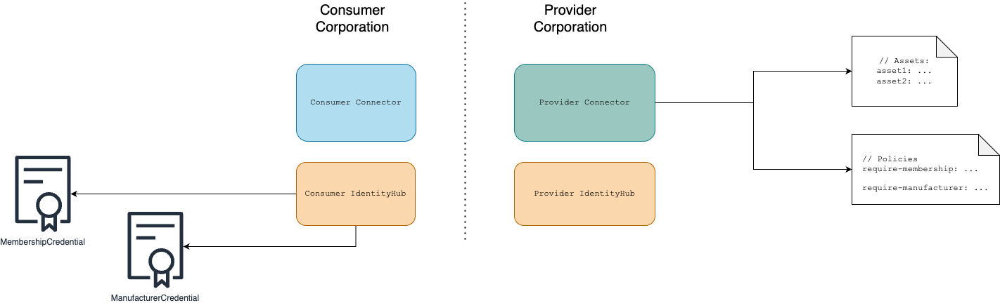
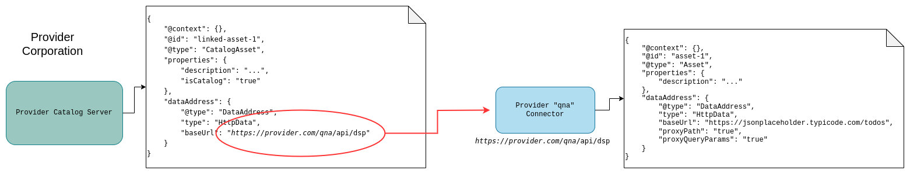

# Minimum Viable Dataspace Demo

<!-- TOC -->

* [Minimum Viable Dataspace Demo](#minimum-viable-dataspace-demo)
    * [1. Introduction](#1-introduction)
    * [2. Purpose of this Demo](#2-purpose-of-this-demo)
    * [3. The Scenario](#3-the-scenario)
        * [3.1 Participants](#31-participants)
        * [3.2 Data setup](#32-data-setup)
        * [3.3 Access control](#33-access-control)
        * [3.4 DIDs, participant lists and VerifiableCredentials](#34-dids-participant-lists-and-verifiablecredentials)
    * [4. Running the demo (inside IntelliJ)](#4-running-the-demo-inside-intellij)
        * [4.1 Start NGINX](#41-start-nginx)
        * [4.2 Starting the runtimes](#42-starting-the-runtimes)
        * [4.3 Seeding the dataspace](#43-seeding-the-dataspace)
        * [4.4 Next steps](#44-next-steps)
    * [5. Running the Demo (Kubernetes)](#5-running-the-demo-kubernetes)
        * [5.1 Build the runtime images](#51-build-the-runtime-images)
        * [5.2 Create the K8S cluster](#52-create-the-k8s-cluster)
        * [5.3 Seed the dataspace](#53-seed-the-dataspace)
        * [5.4 Debugging MVD in Kubernetes](#54-debugging-mvd-in-kubernetes)
    * [6. Differences between Kubernetes and IntelliJ](#6-differences-between-kubernetes-and-intellij)
        * [6.1 In-memory databases](#61-in-memory-databases)
        * [6.2 Memory-based secret vaults](#62-memory-based-secret-vaults)
        * [6.3 Embedded vs Remote STS](#63-embedded-vs-remote-sts)
    * [7. Executing REST requests using Postman](#7-executing-rest-requests-using-postman)
        * [7.1 Get the catalog](#71-get-the-catalog)
        * [7.2 Initiate the contract negotiation](#72-initiate-the-contract-negotiation)
        * [7.3 Query negotiation status](#73-query-negotiation-status)
        * [7.4 Initiate data transfer](#74-initiate-data-transfer)
        * [7.5 Query data transfers](#75-query-data-transfers)
        * [7.6 Get EndpointDataReference](#76-get-endpointdatareference)
        * [7.7 Get access token for EDR](#77-get-access-token-for-edr)
        * [7.8 Fetch data](#78-fetch-data)
    * [8. Custom extensions in MVD](#8-custom-extensions-in-mvd)
        * [8.1 Catalog Node Resolver](#81-catalog-node-resolver)
        * [8.2 Default scope mapping function](#82-default-scope-mapping-function)
        * [8.3 Scope extractor for `DataProcessor` credentials](#83-scope-extractor-for-dataprocessor-credentials)
        * [8.4 Policy evaluation functions](#84-policy-evaluation-functions)
            * [8.4.1 Membership evaluation function](#841-membership-evaluation-function)
            * [8.4.2 DataAccessLevel evaluation function](#842-dataaccesslevel-evaluation-function)
        * [8.5 Scope-to-criterion transformer](#85-scope-to-criterion-transformer)
        * [8.6 Super-user seeding](#86-super-user-seeding)
    * [9. Advanced topics](#9-advanced-topics)
        * [9.1 Regenerating issuer keys](#91-regenerating-issuer-keys)
        * [9.2 Regenerating participant keys](#92-regenerating-participant-keys)
            * [9.2.1 IntelliJ deployment:](#921-intellij-deployment)
            * [9.2.2 Kubernetes deployment](#922-kubernetes-deployment)
    * [10. Other caveats, shortcuts and workarounds](#10-other-caveats-shortcuts-and-workarounds)
        * [10.1 In-memory stores in local deployment](#101-in-memory-stores-in-local-deployment)
        * [10.2 DID resolution](#102-did-resolution)
            * [10.2.1 `did:web` for participants](#1021-didweb-for-participants)
            * [10.2.2 `did:web` for the dataspace issuer](#1022-didweb-for-the-dataspace-issuer)
        * [10.3 No issuance (yet)](#103-no-issuance-yet)

<!-- TOC -->

## 1. Introduction

The Decentralized Claims Protocol defines a secure way how to participants in a dataspace can exchange and present
credential information. In particular, the [DCP specification](https://github.com/eclipse-tractusx/identity-trust)
defines the _Presentation Flow_, which is the process of requesting, presenting and verifying Verifiable Credentials.

So in order to get the most out of this demo, a basic understanding of VerifiableCredentials, VerifiablePresentations,
Decentralized Identifiers (DID) and cryptography is necessary. These concepts will not be explained here further.

The Presentation Flow was adopted in the Eclipse Dataspace Components project and is currently implemented in modules
pertaining to the [Connector](https://github.com/eclipse-edc/connector) as well as the
[IdentityHub](https://github.com/eclipse-edc/IdentityHub).

## 2. Purpose of this Demo

This demo is to demonstrate how two dataspace participants can perform a credential exchange prior to a DSP message
exchange, for example requesting a catalog or negotiating a contract.

It must be stated in the strongest terms that this is **NOT** a production grade installation, nor should any
production-grade developments be based on it. [Shortcuts](#10-other-caveats-shortcuts-and-workarounds) were taken, and
assumptions were made that are potentially invalid in other scenarios.

It merely is a playground for developers wanting to kick the tires in the EDC and DCP space, and its purpose is to
demonstrate how DCP works to an otherwise unassuming audience.

## 3. The Scenario

_In this example, we will see how two companies can share data through federated catalogs using [Management
Domains](https://github.com/eclipse-edc/Connector/blob/main/docs/developer/management-domains/management-domains.md)._

### 3.1 Participants

There are two fictitious companies, called "Provider Corp" and "Consumer Corp". "Consumer Corp" wants to consume data
from "Provider Corp". Provider Corp has two departments "Q&A" and "Manufacturing". Both are independent and host their
own EDC connectors, named "provider-qna" and "provider-manufacturing". Both are administered individually, but don't
expose their data catalog directly to the internet.

To make the catalogs available, Provider Corp also hosts a catalog server that is shared between the catalog server,
"provider-qna"" and "provider-manufacturing".

Both Consumer Corp and Provider Corp operate an IdentityHub each. Note that This is necessary, because those three
share the same `participantId`, and thus, the same set of credentials. A catalog server is a stripped-down EDC runtime,
that only contains modules for servicing catalog requests.

Consumer Corp has a connector plus its own IdentityHub.



### 3.2 Data setup

"provider-qna" and "provider-manufacturing" both have two data assets each, named `"asset-1"` and `"asset-2"` but
neither "provider-qna" nor "provider-manufacturing" expose their catalog endpoint directly to the internet. Instead, the
catalog server (of the Provider Corp) provides a catalog that contains special assets (think: pointers) to both "
provider-qna"'s and "provider-manufacturing"'s connectors, specifically, their DSP endpoints.

We call this a "root catalog", and the pointers are called "catalog assets". This means, that by resolving the root
catalog, and by following the links therein, "Consumer Corp" can resolve the actual asset from "provider-qna" and
"provider-manufacturing".



Linked assets, or `CatalogAsset` objects are easily recognizable by the `"isCatalog": true` property. They do not
contain any metadata, only a link to service URL, where the actual asset is available.

Note that the consumer connector does not contain any data assets in this scenario.

### 3.3 Access control

In this fictitious dataspace there are two types of VerifiableCredentials:

- `MembershipCredential`: contains information about the holder's membership in the dataspace as well as some holder
  information
- `DataProcessorCredential`: contains the version of the "Data Organization and Processing Edict (DOPE)" the holder has
  signed and it attests to the "ability of the holder to process data at a certain level". The following levels exist:
    - `"processing"`: means, the holder can process non-sensitive data
    - `"sensitive"`: means, the holder has undergone "some very highly secure vetting process" and can process sensitive
      data

  The information about the level of data a holder can process is stored in the `credentialSubject` of the
  DataProcessorCredential.

Both assets of "provider-qna" and "provider-manufacturing" have some access restrictions on their assets:

- `asset-1`: requires a MembershipCredential to view and a DataProcessorCredential with `"level": "processing"` to
  negotiate a contract and transfer data
- `asset-2`: requires a MembershipCredential to view and a DataProcessorCredential with a `"level": "sensitive"` to
  negotiate a contract

These requirements are formulated as EDC policies:

```json
{
  "policy": {
    "@type": "Set",
    "obligation": [
      {
        "action": "use",
        "constraint": {
          "leftOperand": "DataAccess.level",
          "operator": "eq",
          "rightOperand": "processing"
        }
      }
    ]
  }
}
```

In addition, it is a dataspace rule that the `MembershipCredential` must be presented in _every_ DSP request. This
credential attests that the holder is a member of the dataspace.

All participants of the dataspace are in possession of the `MembershipCredential` as well as a `DataProcessorCredential`
with level `"processing"`.

> None possess the `DataProcessorCredential` with level="sensitive".

That means that no contract for `asset-2` can be negotiated by anyone. For the purposes of this demo the
VerifiableCredentials are pre-created and are seeded directly to the participants' credential storage ([no
issuance](#103-no-issuance-yet)) via a dedicated
[extension](launchers/identity-hub/src/main/java/org/eclipse/edc/demo/dcp/ih/IdentityHubExtension.java).

When the consumer wants to inspect the consolidated catalog (containing assets from both the provider's Q&A and
manufacturing departments), then negotiate a contract for an asset, and then transfer the asset, several credentials
need to be presented:

- catalog request: present `MembershipCredential`
- contract negotiation: `MembershipCredential` and `DataProcessorCredential(level=processing)` or
  `DataProcessorCredential(level=sensitive)`, respectively
- transfer process: `MembershipCredential`

### 3.4 DIDs, participant lists and VerifiableCredentials

Participant Identifiers in MVD are Web-DIDs. They are used to identify the holder of a VC, to reference public key
material and to tell the FederatedCatalog Crawlers whom to crawl. DID documents contain important endpoint information,
namely the connector's DSP endpoint and it's CredentialService endpoint. That means that all relevant information about
participants can be gathered simply by resolving and inspecting its DID document.

One caveat is that with `did:web` DIDs there is a direct coupling between the identifier and the URL. The `did:web:xyz`
identifier directly translates to the URL where the document is resolvable.

In the context of MVD this means that different DIDs have to be used when running from within IntelliJ versus running in
Kubernetes, since the URLs are different. As a consequence, for every VerifiableCredential there are two variants, one
that contains the "localhost" DID and one that contains the DID with the Kubernetes service URL. Also, the participant
lists are different between those two.

## 4. Running the demo (inside IntelliJ)

> Please note that due to the way how Windows handles file paths, running the IntelliJ Run Configs on Windows can
> sometimes cause problems. We recommend either running this from within WSL or on a Linux machine. Alternatively, paths
> could be corrected manually. Running MVD natively on Windows is not supported!

There are several run configurations for IntelliJ in the `.run/` folder. One each for the consumer and provider
connectors runtimes and IdentityHub runtimes plus one for the provider catalog server, and one named "dataspace". The
latter is a compound run config an brings up all other runtimes together.

### 4.1 Start NGINX

The issuer's DID document is hosted on NGINX, so the easiest way of running NGINX is with a docker container:

```shell
docker run -d --name nginx -p 9876:80 --rm \
  -v "$PWD"/deployment/assets/issuer/nginx.conf:/etc/nginx/nginx.conf:ro \
  -v "$PWD"/deployment/assets/issuer/did.docker.json:/var/www/.well-known/did.json:ro \
  nginx
```

To verify that it worked, please execute `curl -X GET http://localhost:9876/.well-known/did.json` and see if it returns
a
DID document as JSON structure:

```json
{
  "service": [],
  "verificationMethod": [
    {
      "id": "did:web:localhost%3A9876#key-1",
      "type": "JsonWebKey2020",
      "controller": "did:web:localhost%3A9876",
      "publicKeyMultibase": null,
      "publicKeyJwk": {
        "kty": "OKP",
        "crv": "Ed25519",
        "x": "Hsq2QXPbbsU7j6JwXstbpxGSgliI04g_fU3z2nwkuVc"
      }
    }
  ],
  "authentication": [
    "key-1"
  ],
  "id": "did:web:localhost%3A9876",
  "@context": [
    "https://www.w3.org/ns/did/v1",
    {
      "@base": "did:web:localhost%3A9876"
    }
  ]
}
```

The port mapping is **important**, because it influences the DID of the issuer: with a host port of
`9876` the issuer DID resolves to `did:web:localhost%3A9876`. Changing the port mapping changes the DID, soif you change
the port mapping, be sure to execute a search-and-replace!

Naturally, you are free to install NGINX natively on your computer or use any other webserver altogether, but this won't
be supported by us.

### 4.2 Starting the runtimes

The connector runtimes contain both the controlplane and the dataplane. Note that in a real-world scenario those would
likely be separate runtimes to be able to scale and deploy them individually. Note also, that the Kubernetes deployment
(next chapter) does indeed run them as separate pods.

The run configs use the `temurin-22` JDK. If you don't have it installed already, you can choose to install it (IntelliJ
makes this really easy), or to select whatever JDK you have available in each run config.

All run configs take their configuration from `*.env` files which are located in `deployment/assets/env`.

### 4.3 Seeding the dataspace

DID documents are dynamically generated when "seeding" the data, specifically when creating the `ParticipantContext`
objects in IdentityHub. This is automatically being done by a script `seed.sh`.

After executing the `dataspace` run config in Intellij, be sure to **execute the `seed.sh` script after all the runtimes
have started**. Omitting to do so will leave the dataspace in an uninitialized state and cause all
connector-to-connector communication to fail.

### 4.4 Next steps

All REST requests made from the script are available in the [Postman
collection](./deployment/postman/MVD.postman_collection.json). With the [HTTP
Client](https://www.jetbrains.com/help/idea/http-client-in-product-code-editor.html) and [Import from Postman
Collections](https://plugins.jetbrains.com/plugin/22438-import-from-postman-collections) plugins, the Postman collection
can be imported and then executed by means of the [environment file](./deployment/postman/http-client.env.json),
selecting the "Local" environment.

Please read [chapter 7](#7-executing-rest-requests-using-postman) for details.

## 5. Running the Demo (Kubernetes)

For this section a basic understanding of Kubernetes, Docker, Gradle and Terraform is required. It is assumed that the
following tools are installed and readily available:

- Docker
- KinD (other cluster engines may work as well - not tested!)
- Terraform
- JDK 17+
- Git
- a POSIX compliant shell
- Postman (to comfortably execute REST requests)
- `openssl`, optional, but required to [regenerate keys](#91-regenerating-issuer-keys)
- `newman` (to run Postman collections from the command line)
- not needed, but recommended: Kubernetes monitoring tools like K9s

All commands are executed from the **repository's root folder** unless stated otherwise via `cd` commands.

> Since this is not a production deployment, all applications are deployed _in the same cluster_ and in the same
> namespace, plainly for the sake of simplicity.

### 5.1 Build the runtime images

```shell
./gradlew build
./gradlew -Ppersistence=true dockerize
```

this builds the runtime images and creates the following docker images: `controlplane:latest`, `dataplane:latest`,
`catalog-server:latest` and `identity-hub:latest` in the local docker image cache. Note the `-Ppersistence` flag which
puts the HashiCorp Vault module and PostgreSQL persistence modules on the runtime classpath.

> This demo will not work properly, if the `-Ppersistence=true` flag is omitted!

PostgreSQL and Hashicorp Vault obviously require additional configuration, which is handled by the Terraform scripts.

### 5.2 Create the K8S cluster

After the runtime images are built, we bring up and configure the Kubernetes cluster. We are using KinD here, but this
should work similarly well on other cluster runtimes, such as MicroK8s, K3s or Minikube. Please refer to the respective
documentation for more information.

```shell
# Create the cluster
kind create cluster -n mvd --config deployment/kind.config.yaml

# Load docker images into KinD
kind load docker-image controlplane:latest dataplane:latest identity-hub:latest catalog-server:latest sts:latest -n mvd

# Deploy an NGINX ingress
kubectl apply -f https://raw.githubusercontent.com/kubernetes/ingress-nginx/main/deploy/static/provider/kind/deploy.yaml

# Wait for the ingress controller to become available
kubectl wait --namespace ingress-nginx \
  --for=condition=ready pod \
  --selector=app.kubernetes.io/component=controller \
  --timeout=90s

# Deploy the dataspace, type 'yes' when prompted
cd deployment
terraform init
terraform apply
```

Once Terraform has completed the deployment, type `kubectl get pods` and verify the output:

```shell
❯ kubectl get pods --namespace mvd
NAME                                                  READY   STATUS    RESTARTS   AGE
consumer-controlplane-5854f6f4d7-pk4lm                1/1     Running   0          24s
consumer-dataplane-64c59668fb-w66vz                   1/1     Running   0          17s
consumer-identityhub-57465876c5-9hdhj                 1/1     Running   0          24s
consumer-postgres-6978d86b59-8zbps                    1/1     Running   0          40s
consumer-vault-0                                      1/1     Running   0          37s
provider-catalog-server-7f78cf6875-bxc5p              1/1     Running   0          24s
provider-identityhub-f9d8d4446-nz7k7                  1/1     Running   0          24s
provider-manufacturing-controlplane-d74946b69-rdqnz   1/1     Running   0          24s
provider-manufacturing-dataplane-546956b4f8-hkx85     1/1     Running   0          17s
provider-postgres-75d64bb9fc-drf84                    1/1     Running   0          40s
provider-qna-controlplane-6cd65bf6f7-fpt7h            1/1     Running   0          24s
provider-qna-dataplane-5dc5fc4c7d-k4qh4               1/1     Running   0          17s
provider-vault-0                                      1/1     Running   0          36s
```

The consumer company has a controlplane, a dataplane, an IdentityHub, a postgres database and a vault to store secrets.
The provider company has a catalog server, a "provider-qna" and a "provider-manufacturing" controlplane/dataplane combo
plus an IdentityHub, a postgres database and a vault.

It is possible that pods need to restart a number of time before the cluster becomes stable. This is normal and
expected. If pods _don't_ come up after a reasonable amount of time, it is time to look at the logs and investigate.

Remote Debugging is possible, but Kubernetes port-forwards are necessary.

### 5.3 Seed the dataspace

Once all the deployments are up-and-running, the seed script needs to be executed which should produce command line
output similar to this:

```shell
./seed-k8s.sh


Seed data to "provider-qna" and "provider-manufacturing"
(node:545000) [DEP0040] DeprecationWarning: The `punycode` module is deprecated. Please use a userland alternative instead.
(Use `node --trace-deprecation ...` to show where the warning was created)
(node:545154) [DEP0040] DeprecationWarning: The `punycode` module is deprecated. Please use a userland alternative instead.
(Use `node --trace-deprecation ...` to show where the warning was created)


Create linked assets on the Catalog Server
(node:545270) [DEP0040] DeprecationWarning: The `punycode` module is deprecated. Please use a userland alternative instead.
(Use `node --trace-deprecation ...` to show where the warning was created)


Create consumer participant
ZGlkOndlYjphbGljZS1pZGVudGl0eWh1YiUzQTcwODM6YWxpY2U=.KPHR02XRnn+uT7vrpCIu8jJUADTBHKrterGq0PZTRJgzbzvgCXINcMWM3WBraG0aV/NxdJdl3RH3cqgyt+b5Lg==

Create provider participant
ZGlkOndlYjpib2ItaWRlbnRpdHlodWIlM0E3MDgzOmJvYg==.wBgVb44W6oi3lXlmeYsH6Xt3FAVO1g295W734jivUo5PKop6fpFsdXO4vC9D4I0WvqfB/cARJ+FVjjyFSIewew==%
```

_the `node` warnings are harmless and can be ignored_

> Failing to run the seed script will leave the dataspace in an uninitialized state and cause all connector-to-connector
> communication to fail.
>

### 5.4 JVM crashes with `SIGILL` on ARM platforms

We have noticed, that the JVM inside the Docker container sometimes crashes with a `SIGILL` signal right
away without even starting the runtime. So far we've only seen this on ARM platforms such as Apple Silicon. The `UseSVE`
option seems to [mitigate this](https://github.com/corretto/corretto-21/issues/85). If you are affected by this, please
try enabling the `useSVE` switch:

```
terraform apply -var="useSVE=true"
```

This will add the `-XX:UseSVE=0` switch to the `JAVA_TOOL_OPTIONS` in all runtimes, enabling the Scalable Vector
Extensions that are available on ARM processors. Alternatively, you can also set the `useSVE = true` variable in a
`*.tfvars` file, cf. [documentation](https://developer.hashicorp.com/terraform/language/values/variables).

_Important note: on non-ARM platforms, the `-XX:UseSVE=0` VM option is not recognized and will crash the JVM!_

### 5.5 Debugging MVD in Kubernetes

All of MVD's runtime images come with remote JVM debugging enabled by default. This is configured by setting an
environment variable

```
JAVA_TOOL_OPTIONS="-agentlib:jdwp=transport=dt_socket,server=y,suspend=n,address=<DEBUG_PORT>"
```

All runtimes use port **1044** for debugging, unless configured otherwise in terraform. The only thing left to do for
you is to create a Kubernetes port-forwarding:

```shell
kubectl port-forward -n mvd service/consumer-controlplane 1044:1044
```

This assumes the default Kubernetes namespace `mvd`. Note that the port-forward targets a `service` to have it
consistent across pod restarts, but targeting a specific pod is also possible. Please refer to the official
documentation for details.

The host port (the value after the `:`) is completely arbitrary, and should be altered if multiple runtimes are debugged
in parallel.

When creating a "Remote JVM Debug" run configuration in IntelliJ it is important to select the appropriate module
classpath. Those are generally located in the `launchers/` directory.

Please also refer to the [official IntelliJ tutorial](https://www.jetbrains.com/help/idea/tutorial-remote-debug.html) on
how to do remote debugging.

## 6. Differences between Kubernetes and IntelliJ

The focus with the Kubernetes deployment is to achieve a "one-click-deployment" (don't count them, it's more than 1)
with minimum hassle for people who don't necessarily have developer tools installed on their computers. Conversely, the
deployment with IntelliJ is intended to give developers an easy way to debug and trace the code base, and to extend and
play with MVD without having to do the entire rebuild-docker-image-redeploy loop every time. Also, debugging is much
easier.

However, to keep the IntelliJ setup as simple as possible, a few shortcuts were taken:

### 6.1 In-memory databases

No persistent storage is available, because that would have meant manually setting up and
populating several PostgreSQL databases. Everytime a runtime (re-)starts, it starts with a clean slate. This can cause
some inconsistencies, e.g. when consumer and provider have negotiated a contract, and the provider restarts, the
contract will be missing from its database. Keep that in mind. It is recommended to always restart the _entire_
dataspace with the included composite run config.

### 6.2 Memory-based secret vaults

This is the big one. Since the memory-vault is compiled into the runtime, components of one
participant (e.g. controlplane and identityhub) _do not share_ vault secrets, because their vaults are different. Thus,
all secrets that need to be accessed by multiple components must be pre-populated.

### 6.3 Embedded vs Remote STS

While in the Kubernetes deployment the SecureTokenService (S)S is a stand-alone component, in the IntelliJ
deployment it is embedded into the controlplane. The reason for this is, that during seeding a participant context and
an STS Account is created. This includes a (generated) client secret, that gets stored in the vault.

In the IntelliJ case that vault is purely in-memory and is isolated in IdentityHub, with no way to access it from the
connector's controlplane. So the connector's controlplane and IdentityHub physically cannot share any secrets. To
overcome this, STS is simply embedded in the controlplane directly.

In the Kubernetes deployment this limitation goes away, because a dedicated vault service (HashiCorp Vault) is used,
which is accessible from either component.

## 7. Executing REST requests using Postman

This demo comes with a Postman collection located in `deployment/postman`. Be aware that the collection has different
sets of variables in different environments, "MVD local development" and "MVD K8S". These are located in the same
directory and must be imported into Postman too.

The collection itself is pretty self-explanatory, it allows you to request a catalog, perform a contract negotiation and
execute a data transfer.

The following sequence must be observed:

### 7.1 Get the catalog

to get the dataspace catalog across all participants, execute `ControlPlane Management/Get Cached Catalog`. Note that it
takes a few seconds for the consumer connector to collect all entries. Watch out for a dataset entry named `asset-1`
similar to this:

```json
                  {
  "@id": "asset-1",
  "@type": "dcat:Dataset",
  "odrl:hasPolicy": {
    "@id": "bWVtYmVyLWFuZC1wY2YtZGVm:YXNzZXQtMQ==:MThhNTgwMzEtNjE3Zi00N2U2LWFlNjMtMTlkZmZlMjA5NDE4",
    "@type": "odrl:Offer",
    "odrl:permission": [],
    "odrl:prohibition": [],
    "odrl:obligation": {
      "odrl:action": {
        "@id": "use"
      },
      "odrl:constraint": {
        "odrl:leftOperand": {
          "@id": "DataAccess.level"
        },
        "odrl:operator": {
          "@id": "odrl:eq"
        },
        "odrl:rightOperand": "processing"
      }
    }
  },
  "dcat:distribution": [
    //...
  ],
  "description": "This asset requires Membership to view and negotiate.",
  "id": "asset-1"
},
```

for the purposes of this tutorial we'll focus on the offers from the Provider's Q&A department, so the associated
service entry should be:

```json
{
  "dcat:service": {
    // ...
    "dcat:endpointUrl": "http://provider-qna-controlplane:8082/api/dsp",
    "dcat:endpointDescription": "dspace:connector"
    // ...
  }
}
```

Important: copy the `@id` value of the `odrl:hasPolicy`, we'll need that to initiate the negotiation!

### 7.2 Initiate the contract negotiation

From the previous step we have the `odrl:hasPolicy.@id` value, that should look something like
`bWVtYmVyLWFuZC1wY2YtZGVm:YXNzZXQtMQ==:MThhNTgwMzEtNjE3Zi00N2U2LWFlNjMtMTlkZmZlMjA5NDE4`. This value must now be copied
into the `policy.@id` field of the `ControlPlane Management/Initiate Negotiation` request of the Postman collection:

```json
//...
"counterPartyId": "{{PROVIDER_ID}}",
"protocol": "dataspace-protocol-http",
"policy": {
"@type": "Offer",
"@id": "bWVtYmVyLWFuZC1wY2YtZGVm:YXNzZXQtMQ==:MThhNTgwMzEtNjE3Zi00N2U2LWFlNjMtMTlkZmZlMjA5NDE4",
//...
```

You will receive a response immediately, but that only means that the request has been received. In order to get the
current status of the negotiation, we'll have to inquire periodically.

### 7.3 Query negotiation status

With the `ControlPlane Management/Get Contract Negotiations` request we can periodically query the status of all our
contract negotiations. Once the state shows `FINALIZED`, we copy the value of the `contractAgreementId`:

```json
{
  //...
  "state": "FINALIZED",
  "contractAgreementId": "3fb08a81-62b4-46fb-9a40-c574ec437759"
  //...
}
```

### 7.4 Initiate data transfer

From the previous step we have the `contractAgreementId` value `3fb08a81-62b4-46fb-9a40-c574ec437759`. In the
`ControlPlane Management/Initiate Transfer` request we will paste that into the `contractId` field:

```json
{
  //...
  "contractId": "3fb08a81-62b4-46fb-9a40-c574ec437759",
  "dataDestination": {
    "type": "HttpProxy"
  },
  "protocol": "dataspace-protocol-http",
  "transferType": "HttpData-PULL"
}
```

### 7.5 Query data transfers

Like with contract negotiations, data transfers are asynchronous processes so we need to periodically query their status
using the `ControlPlane Management/Get transfer processes` request. Once we find a `"state": "STARTED"` field in the
response, we can move on.

The type of data transfer that we are using here (`HttpData-PULL`) means that we can fetch data from the provider
dataplane's public endpoint, as we would query any other REST API. However, an access token is needed to authenticate
the request. This access token is provided to the consumer in the form of an EndpointDataReference (EDR). We must thus
query the consumer's EDR endpoint to obtain the token.

### 7.6 Get EndpointDataReference

Using the `ControlPlane Management/Get Cached EDRs` request, we fetch the EDR and note down the value of the `@id`
field, for example `392d1767-e546-4b54-ab6e-6fb20a3dc12a`. This should be identical to the value of the
`transferProcessId` field.

With that value, we can obtain the access token for this particular EDR.

### 7.7 Get access token for EDR

In the `ControlPlane Management/Get EDR DataAddress for TransferId` request we have to paste the `transferProcessId`
value from the previous step in the URL path, for example:

```
{{HOST}}/api/management/v3/edrs/392d1767-e546-4b54-ab6e-6fb20a3dc12a/dataaddress
```

Executing this request produces a response that contains both the endpoint where we can fetch the data, and the
authorization token:

```json
{
  //...
  "endpoint": "http://provider-qna-dataplane:11002/api/public",
  "authType": "bearer",
  "endpointType": "https://w3id.org/idsa/v4.1/HTTP",
  "authorization": "eyJra.....PbovoypJGtWJst30vD9zy5w"
  //...
}
```

Note that the token was abbreviated for legibility.

### 7.8 Fetch data

Using the endpoint and the authorization token from the previous step, we can then download data using the `ControlPlane
Management/Download Data from Public API` request. To do that, the token must be copied into the request's
`Authorization` header.

Important: do not prepend a `bearer` prefix!

This will return some dummy JSON data.

## 8. Custom extensions in MVD

EDC is not a turn-key application, rather it is a set of modules, that have to be configured, customized and extended to
fit the needs of any particular dataspace.

For our demo dataspace there are a several extensions that are required. These can generally be found in the
`extensions/` directory, or directly in the `src/main/java` folder of the launcher module.

### 8.1 Catalog Node Resolver

Out-of-the-box the FederatedCatalog comes with an in-memory implementation of the `TargetNodeDirectory`. A
`TargetNodeDirectory` is a high-level list of participants of the dataspace, a "phone book" if you will. In MVD that
phone book is constituted by a hard-coded [file](./deployment/assets/participants), where every participant is listed
with their DID.

To keep things simple, MVD comes with a custom
[implementation](extensions/catalog-node-resolver/src/main/java/org/eclipse/edc/demo/participants/resolver/LazyLoadNodeDirectory.java)
for those participant directory files.

Everything we need such as DSP URLs, public keys, CredentialService URLs is resolved from the DID document.

### 8.2 Default scope mapping function

As per our [dataspace rules](#33-access-control), every DSP request has to be secured by presenting the Membership
credential, even the Catalog request. In detail, this means, that every DSP request that the consumer sends, must carry
a token in the Authorization header, which authorizes the verifier to obtain the MembershipCredential from the
consumer's IdentityHub.

We achieve this by intercepting the DSP request and adding the correct scope - here:
`"org.eclipse.edc.vc.type:MembershipCredential:read"` - to the request builder. Technically, this is achieved by
registering a `postValidator` function for the relevant policy scopes, check out the
[DcpPatchExtension.java](extensions/dcp-impl/src/main/java/org/eclipse/edc/demo/dcp/core/DcpPatchExtension.java) class.

### 8.3 Scope extractor for `DataProcessor` credentials

When the consumer wants to negotiate a contract for an offer, that has a `DataAccess.level` constraint, it must add the
relevant scope string to the access token upon DSP egress. A policy, that requires the consumer to present a
`DataProcessorCredential`, where the access level is `processing` would look like this:

```json
{
  "@type": "Set",
  "obligation": [
    {
      "action": "use",
      "constraint": {
        "leftOperand": "DataAccess.level",
        "operator": "eq",
        "rightOperand": "processing"
      }
    }
  ]
}
```

The
[DataAccessCredentialScopeExtractor.java](extensions/dcp-impl/src/main/java/org/eclipse/edc/demo/dcp/core/DataAccessCredentialScopeExtractor.java)
class would convert this into a scope string `org.eclipse.edc.vc.type:DataProcessorCredential:read` and add it to the
consumer's access token.

### 8.4 Policy evaluation functions

Being able to express a constraint in ODRL gets us only halfway there, we also need some code to evaluate that
expression. In EDC, we do this by registering policy evaluation functions with the policy engine.

Since our dataspace defines two credential types, which can be used in policies, we also need two evaluation functions.

#### 8.4.1 Membership evaluation function

This function is used to evaluate Membership constraints in policies by asserting that the Membership credential is
present, is not expired and the membership is in force. This is implemented in the
[MembershipCredentialEvaluationFunction.java](extensions/dcp-impl/src/main/java/org/eclipse/edc/demo/dcp/policy/MembershipCredentialEvaluationFunction.java).

#### 8.4.2 DataAccessLevel evaluation function

Similarly, to evaluate `DataAccess.level` constraints, there is a
[DataAccessLevelFunction.java](extensions/dcp-impl/src/main/java/org/eclipse/edc/demo/dcp/policy/DataAccessLevelFunction.java)
class, that asserts that a DataProcessor credential is present, and that the level is appropriate. Note that to do that,
the function implementation needs to have knowledge about the shape and schema of the `credentialSubject` of the
DataProcessor VC.

> Hint: all credentials, where the `credentialSubject` has the same shape/schema can be evaluated by the same function!

### 8.5 Super-user seeding

IdentityHub's [Identity
API](https://github.com/eclipse-edc/IdentityHub/blob/main/docs/developer/architecture/identityhub-apis.md#identity-api)
is secured with a basic RBAC system. For this, there is a special role called the `"super-user"`. Creating participants
must be done using this role, but unless this role exists, we can't create any participants... so we are facing a bit of
a chicken-and-egg problem.

This is why seeding the "super-user" is done directly from code using the
[ParticipantContextSeedExtension.java](extensions/superuser-seed/src/main/java/org/eclipse/edc/identityhub/seed/ParticipantContextSeedExtension.java).

If a "super-user" does not already exist, one is created in the database using defaults. Feel free to override the
defaults and customize your "super-user" and find out what breaks :)

> NB: doing this in anything but a demo installation is **not** recommended, as it poses significant security risks!

## 9. Advanced topics

### 9.1 Regenerating issuer keys

The dataspace issuer is the authoritative entity that can issue Verifiable Credentials to participants. For that, two
things are needed: a private/public key pair to sign credentials, and a DID document for verifiers to obtain the
dataspace issuer's public key.

Consequently, when the dataspace issuer's keys should be updated, these aforementioned places are relevant.

The first step is to create a new key pair:

```shell
openssl genpkey -algorithm ed25519 -out deployment/assets/issuer_private.pem
openssl pkey -in assets/issuer_private.pem -pubout -out assets/issuer_public.pem
```

These puts a new key pair in `deployment/assets/`. Note that the path is arbitrary, but needs to be consistent with
subsequent steps.
Next, we need to re-sign the participants' credentials, update the database seed data and update the issuer's DID
document.

There is no easy or convenient way to do this natively on the command line, so we created a test
named [JwtSigner.java](launchers/identity-hub/src/test/java/org/eclipse/edc/demo/dcp/JwtSigner.java) that does all that.
Simply executing the test performs all these steps, updates files etc.

The only thing left to do is to clean-rebuild-restart the applications (IntelliJ) or rebuild and redeploy (Kubernetes).

> We strongly encourage readers to closely inspect the `JwtSigner` code, because it shows how key conversion, document
> handling etc. can be done in EDC!

### 9.2 Regenerating participant keys

#### 9.2.1 IntelliJ deployment:

keys must be seeded at startup time (due to [this limitation](#62-memory-based-secret-vaults)).
In addition, if consumer and provider have the same key, that makes things a bit easier, because it removes the need to
seed the keys via config or commandline argument. That said, the process is similar to the dataspace issuer:

```shell
openssl genpkey -algorithm ed25519 -out deployment/assets/consumer_private.pem
openssl pkey -in assets/consumer_private.pem -pubout -out assets/consumer_public.pem

# use the same key for provider:
cp  deployment/assets/consumer_private.pem  deployment/assets/provider_private.pem
cp  deployment/assets/consumer_public.pem  deployment/assets/provider_public.pem
```

Now comes the hacky part, reader discretion is advised.
In [SecretsExtension.java](extensions/did-example-resolver/src/main/java/org/eclipse/edc/iam/identitytrust/core/SecretsExtension.java)
replace the String block for the private and public key with the contents of the newly created `*.pem` files.

Clean-rebuild-restart the applications. Don't forget to [seed](#43-seeding-the-dataspace). Done.

#### 9.2.2 Kubernetes deployment

Here, participant keys are dynamically generated by IdentityHub, so there is no need to pre-generate them. In fact,
everytime the dataspace is re-deployed and the [seed script](#53-seed-the-dataspace) is executed, a new key pair is
generated for each participant.
To be extra-precise, the keys are regenerated when a new `ParticipantContext` is created.

## 10. Other caveats, shortcuts and workarounds

It must be emphasized that this is a **DEMO**, it does not come with any guarantee w.r.t. operational readiness and
comes with a few significant shortcuts affecting security amongst other things, for the sake of simplicity. These are:

### 10.1 In-memory stores in local deployment

When running the MVD from IntelliJ, the runtimes exclusively use in-memory stores and in-memory vaults. We opted for
this to avoid having to either provide (and maintain) a docker-compose file for those services, or to put users through
an arduous amount of setup and configuration.

The Kubernetes deployment uses both persistent storage (PostgreSQL) and secure vaults (Hashicorp Vault).

### 10.2 DID resolution

#### 10.2.1 `did:web` for participants

Participants hosts their DIDs in their IdentityHubs, which means, that the HTTP-URL that the DID maps to must be
accessible for all other participants. For example, every participant pod in the cluster must be able to resolve a DID
from every other participant. For access to pods from outside the cluster we would be using an ingress controller, but
then the other pods in the cluster cannot access it, due to missing DNS entries. That means, that the DID cannot use the
_ingress URL_, but must use the _service's_ URL. A service in turn is not accessible from outside the cluster, so DIDs
are only resolvable from _inside_ the cluster. Unfortunately, there is no way around this, unless we put DIDs on a
publicly resolvable CDN or webserver.

#### 10.2.2 `did:web` for the dataspace issuer

The "dataspace issuer" does not exist as participant yet, so instead of deploying a fake IdentityHub, we opted for
simply hosting the dataspace issuer's DID as static file with NGINX.

### 10.3 No issuance (yet)

All credentials are pre-generated manually because the DCP Issuance Flow is not implemented yet. Credentials are put
into the stores by an extension called `IdentityHubExtension.java` and are **different** for local deployments and
Kubernetes deployments.

The [JwtSigner.java](launchers/identity-hub/src/test/java/org/eclipse/edc/demo/dcp/JwtSigner.java) test class can be
used to re-generate and sign all credentials.

### 10.4 Default scope-to-criterion transformer

When IdentityHub receives a Presentation query, that carries an access token, it must be able to convert a scope string
into a filter expression, for example `org.eclipse.edc.vc.type:DataProcessorCredential:read` is converted into
`verifiableCredential.credential.type = DataProcessorCredential`. This filter expression is then used by IdentityHub to
query for `DataProcessorCredentials` in the database.

The MVD uses the default `EdcScopeToCriterionTransformer` to achieve this. It is recommended to implement a custom
`ScopeToCriterionTransformer` for an actual production scenario.