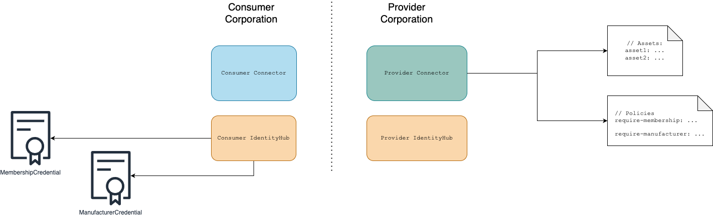

# Minimum Viable Dataspace Demo

<!-- TOC -->
* [Minimum Viable Dataspace Demo](#minimum-viable-dataspace-demo)
  * [1. Introduction](#1-introduction)
  * [2. Purpose of this Demo](#2-purpose-of-this-demo)
    * [2.1 Version stability and backwards compatibility guarantees](#21-version-stability-and-backwards-compatibility-guarantees)
    * [2.2 Which version should I use?](#22-which-version-should-i-use)
  * [3. The Scenario](#3-the-scenario)
    * [3.1 Participants](#31-participants)
    * [3.2 Data setup](#32-data-setup)
    * [3.3 Access control](#33-access-control)
    * [3.4 DIDs, participant lists, and VerifiableCredentials](#34-dids-participant-lists-and-verifiablecredentials)
  * [4. Running the Demo (Kubernetes)](#4-running-the-demo-kubernetes)
    * [4.1 Build the runtime images](#41-build-the-runtime-images)
    * [4.2 Create the K8S cluster](#42-create-the-k8s-cluster)
    * [4.3 Deploy the MVD components](#43-deploy-the-mvd-components)
    * [4.3 Seed the dataspace](#43-seed-the-dataspace)
    * [4.4 Debugging MVD in Kubernetes](#44-debugging-mvd-in-kubernetes)
  * [5. Executing REST requests using Bruno](#5-executing-rest-requests-using-bruno)
    * [5.1 Get the catalog](#51-get-the-catalog)
    * [5.2 Initiate the contract negotiation](#52-initiate-the-contract-negotiation)
    * [5.3 Query negotiation status](#53-query-negotiation-status)
    * [5.4 Initiate data transfer](#54-initiate-data-transfer)
    * [5.5 Query data transfers](#55-query-data-transfers)
    * [5.6 Get EndpointDataReference](#56-get-endpointdatareference)
    * [5.7 Get access token for EDR](#57-get-access-token-for-edr)
    * [5.8 Fetch data](#58-fetch-data)
  * [6. Custom extensions in MVD](#6-custom-extensions-in-mvd)
  * [7. Advanced topics](#7-advanced-topics)
    * [7.2 Regenerating key pairs](#72-regenerating-key-pairs)
  * [8. Other caveats, shortcuts, and workarounds](#8-other-caveats-shortcuts-and-workarounds)
    * [8.2 DID resolution for participants](#82-did-resolution-for-participants)
    * [8.3 Seed Jobs](#83-seed-jobs)
<!-- TOC -->

## 1. Introduction

The Decentralized Claims Protocol defines a secure way how two participants in a dataspace can obtain, exchange, and
present credential information. In particular,
the [DCP specification](https://github.com/eclipse-tractusx/identity-trust) defines the _Presentation Flow_, which is
the process of requesting, presenting, and verifying Verifiable Credentials, and the _Credential Issuance Flow_, which
is
used to request and issue Verifiable Credentials to a dataspace participant.

So to get the most out of this demo, a basic understanding of Verifiable Credentials, Verifiable Presentations,
Decentralized Identifiers (DID) and general cryptography is necessary. These concepts will not be explained here
further.

The Decentralized Claims Protocol was adopted in the Eclipse Dataspace Components project and is currently implemented
in modules pertaining to the [Connector](https://github.com/eclipse-edc/connector) as well as
the [IdentityHub](https://github.com/eclipse-edc/IdentityHub).

## 2. Purpose of this Demo

This demo is to demonstrate how two dataspace participants can perform a credential exchange prior to a DSP message
exchange, for example, requesting a catalog or negotiating a contract.

It must be stated in the strongest terms that this is **NOT** a production grade installation, nor should any
production-grade developments be based on it. [Shortcuts](#10-other-caveats-shortcuts-and-workarounds) were taken, and
assumptions were made that are potentially invalid in other scenarios.

It is merely a playground for developers wanting to kick the tires in the EDC and DCP space, and its purpose is to
demonstrate how DCP works to an otherwise unassuming audience.

### 2.1 Version stability and backwards compatibility guarantees

It is important to understand that while we _do_ tag the git tree at certain times, the intention there is to provide
stable builds for adopters and to avoid randomly breaking builds. MVD releases simply use _release_ versions of upstream
components, as opposed to the `main` branch, which uses `-SNAPSHOT` versions. The latter case can occasionally lead to
breaking builds.

However, all of our development work in MVD targets the `main` branch. In other words, we do not backport bugfixes to
older releases of MVD. If there is a bug or a new feature either in one of the upstream components or MVD, fixes will
_always_ target `main` and will surface in one of the upcoming MVD releases.

This is yet another reason why MVD should _never_ be used in production scenarios.

Please also note that MVD does not publish any artifacts (Maven, Docker images, ...), adopters have to build from
source.

TL;DR – guarantees? There are none. This is a _sample_ project, not a commercial product.

### 2.2 Which version should I use?

The repo's default branch is `main`, which serves as development branch and is checked out by default. If you don't do
anything, then you'll get the absolute latest version of MVD. This is suitable for anyone who is okay with pulling
frequently and with the occasional breakage. The upshot is that this branch will always contain the latest features and
fixes of all upstream components.

> We have monitoring systems in place that inform us about broken builds. No need to raise issues about this.

More conservative developers may fall back
to [releases of MVD](https://github.com/eclipse-edc/MinimumViableDataspace/releases) that use release versions of all
upstream components. If this is you, then remember to check out the appropriate tag after cloning the repo.

Either download the ZIP file and use sources therein, or check out the corresponding tag.

An MVD release version is typically created shortly after an upstream components release.

## 3. The Scenario

In this example, we will see how two companies can share data using DSP and DCP. Each company deploys its own
connector, IdentityHub, and base infrastructure.

### 3.1 Participants

There are two fictitious companies, called "Provider Corp" and "Consumer Corp". "Consumer Corp" wants to consume data
from "Provider Corp". Provider Corp is the data provider, which means, it has to have a catalog of data assets that it
offers to Consumer Corp.

Each company operates its own EDC connector to handle DSP communication, as well as an IdentityHub to handle
VerifiableCredentials and to service DCP interactions.

The Consumer Corp connector does not contain any data assets. This is simply to illustrate the current use case, in
practice there is nothing that would keep the Consumer Corp from also offering data to other companies.



### 3.2 Data setup

The Provider connector has two data assets, named `"asset-1"` and `"asset-2"`, which reference a demo web API.
Note that the consumer connector does not contain any data assets in this scenario.

### 3.3 Access control

In this fictitious dataspace there are two types of VerifiableCredentials:

- `MembershipCredential`: contains information about the holder's membership in the dataspace as well as some holder
  information
- `ManufacturerCredential`: attests that the holder is an accredited manufacturer of "parts" and specifies which parts
  the holder is allowed to manufacture. This is defined in the `"part_types"` field in the credential subject. The
  following variants exist:
    - `"part_type": "non_critical"`: means, the holder can manufacture non-critical parts
    - `"part_type" : "all"`: means, the holder can manufacture everything including saftey-critical parts

  The information about the level of the holder is stored in the `credentialSubject` of the
  ManufacturerCredential.

Each asset of the provider has access restrictions on it:

- `asset-1`: requires a MembershipCredential to view and a ManufacturerCredential with `"part_type": "non_critical"` to
  negotiate a contract and transfer data
- `asset-2`: requires a MembershipCredential to view and a ManufacturerCredential with a `"part_type": "all"`
  to negotiate a contract

These requirements are formulated as EDC policies:

```json
{
  "policy": {
    "@type": "Set",
    "obligation": [
      {
        "action": "use",
        "constraint": {
          "leftOperand": "PartType",
          "operator": "eq",
          "rightOperand": "non_critical"
        }
      }
    ]
  }
}
```

In addition, it is a dataspace rule that the `MembershipCredential` must be presented in _every_ DSP request. This
credential attests that the holder is a member of the dataspace.

All participants of the dataspace are in possession of the `MembershipCredential` as well as a `ManufacturerCredential`
with level `"non_critical"`.

> None possess the `Manufacturer` with part_type="all".

That means that no contract for `asset-2` can be negotiated by anyone.

When the consumer wants to view the catalog, then negotiate a contract for an asset, and then transfer the asset,
several credentials need to be presented:

- catalog request: present `MembershipCredential`
- contract negotiation: `MembershipCredential` and `ManufacturerCredential(part_type=non_critical)` or
  `ManufacturerCredential(part_type=all)`, respectively
- transfer process: `MembershipCredential`

### 3.4 DIDs, participant lists, and VerifiableCredentials

Participant Identifiers in MVD are Web-DIDs. They are used to identify the holder of a VC and to reference public key
material. DID documents contain important endpoint information, namely the connector's DSP endpoint and its
CredentialService endpoint. That means that all relevant information about participants can be gathered simply by
resolving and inspecting its DID document.

One important caveat is that with `did:web` DIDs there is a direct coupling between the identifier and the URL. The
`did:web:xyz` identifier directly translates to the URL where the document is resolvable.

In the context of MVD this means that DIDs have to be crafted such that they reference the internal Kubernetes service
URL of the DID endpoint. Since IdentityHub is used to host DID documents, the Kubernetes service URL is the URL of the
IdentityHub's web endpoint, for example `did:web:identityhub.consumer.svc.cluster.local%3A7083:consumer`, which would
convert into `http://identityhub.consumer.svc.cluster.local:7083/consumer/.well-known/did.json`.

## 4. Running the Demo (Kubernetes)

The demo is intended to be run in Kubernetes, so for this section a basic understanding of Kubernetes, Docker, and
Gradle
is required. It is assumed that the following tools are installed and readily available:

- Docker
- KinD (other cluster engines may work as well – not tested!)
- Helm (used to install the Traefik Gateway Controller)
- JDK 17+
- Git
- a POSIX compliant shell
- Bruno (to comfortably execute REST requests)
- optional, but recommended: Kubernetes monitoring tools like K9s

All commands are executed from the **repository's root folder** unless stated otherwise via `cd` commands.

> Since this is not a production deployment, all applications are deployed _in the same cluster_ and in the same
> namespace, plainly for the sake of simplicity.

### 4.1 Build the runtime images

```shell
./gradlew build
./gradlew dockerize
```

This builds the runtime images and creates the following docker images: `ghcr.io/eclipse-edc/mvd/controlplane:latest`,
`ghcr.io/eclipse-edc/mvd/dataplane:latest`, `ghcr.io/eclipse-edc/mvd/issuerservice:latest` and
`ghcr.io/eclipse-edc/mvd/identity-hub:latest` in the local docker image cache.

PostgreSQL and Hashicorp Vault obviously require additional configuration, which is handled by the Kubernetes manifests
via batch jobs.

### 4.2 Create the K8S cluster

After the runtime images are built, we bring up and configure the Kubernetes cluster. We are using KinD here, but this
should work similarly well on other cluster runtimes, such as MicroK8s, K3s, or Minikube. Please refer to the respective
documentation for more information.

```shell
# Create the cluster
kind create cluster -n mvd

```

### 4.3 Deploy the MVD components
The following commands deploy the MVD components to the cluster.

```shell
# Load docker images into KinD
kind load docker-image \
  ghcr.io/eclipse-edc/mvd/controlplane:latest \
  ghcr.io/eclipse-edc/mvd/dataplane:latest \
  ghcr.io/eclipse-edc/mvd/identity-hub:latest \
  ghcr.io/eclipse-edc/mvd/issuerservice:latest -n mvd

# install Traefik
helm repo add traefik https://traefik.github.io/charts
helm repo update
helm upgrade --install --namespace traefik traefik traefik/traefik --create-namespace -f values.yaml

# Wait for traefik to be ready
kubectl rollout status deployment/traefik -n traefik --timeout=120s

# install Gateway API CRDs
kubectl apply --server-side --force-conflicts -f https://github.com/kubernetes-sigs/gateway-api/releases/download/v1.4.1/experimental-install.yaml

# install MVD using Kustomize
kubectl apply -k k8s

# wait for all init jobs to have completed
kubectl wait -A \
  --selector=type=edc-job \
  --for=condition=complete job --all \
  --timeout=90s
  
# forward port 80 (might require sudo)
kubectl port-forward svc/traefik 80:80 -n traefik
```

Once all jobs have finished, type `kubectl get pods -A` and verify the output:

```shell
❯ kubectl get pods -A
NAME                                                  READY   STATUS    RESTARTS   AGE
consumer             controlplane-6585c89dcb-zzlvw               1/1     Running     0               2d16h
consumer             identityhub-67f54b84c8-7847b                1/1     Running     0               2d16h
consumer             postgres-84bf65d6fb-f65fr                   1/1     Running     0               2d16h
consumer             vault-6b6d47654d-bjvxs                      1/1     Running     0               2d16h
issuer               issuerservice-6f6f8d5f4d-z9lxv              1/1     Running     0               2d16h
issuer               postgres-54b66fb487-g2d8n                   1/1     Running     0               2d16h
issuer               vault-6b6d47654d-z94zn                      1/1     Running     0               2d16h
mvd-common           keycloak-787fbf7dbc-rr2rq                   1/1     Running     0               2d16h
mvd-common           postgres-74bf65fcbd-7j9hw                   1/1     Running     0               2d16h
provider             controlplane-6585c89dcb-dtbwj               1/1     Running     0               2d16h
provider             dataplane-6b46bdbbf-hsrzd                   1/1     Running     0               2d16h
provider             identityhub-67f54b84c8-gbtq8                1/1     Running     0               2d16h
provider             postgres-84bf65d6fb-bl6ft                   1/1     Running     0               2d16h
provider             vault-6b6d47654d-cf8c2                      1/1     Running     0               2d16h
traefik              traefik-696d96b7bb-pprmq                    1/1     Running     1 (2d18h ago)   3d15h
```

_seed job pods and some unrelated pods have been omitted for brevity_

The consumer company has a controlplane, an IdentityHub, a postgres database, and a vault to store secrets.
The provider company has a control plane, a dataplane, plus an IdentityHub, a postgres database, and a vault.

In addition, there is the Issuer service, which is responsible for issuing Verifiable Credentials.

It is possible that pods need to restart a number of times before the cluster becomes stable. This is normal and
expected. If pods _don't_ come up after a reasonable amount of time, it is time to look at the logs and investigate.

Remote Debugging is possible, but Kubernetes port-forwards of port 1044 are necessary.

> Please note that the Keycloak service is deployed _only once_ and is shared by all participants. We are aware that
> this
> is bad practice and should not be done in production, but Keycloak is a very heavy service that takes a long time to
> start up, and we want to keep the demo simple.

### 4.3 Seed the dataspace

Once all pods are up and running, and all seed jobs have completed, all necessary demo data is already in place, no need
to execute scripts or manually invoke the REST API.

This includes:

- vault bootstrap: sets up the vault with the necessary secrets and some configuration
- consumer identityhub: creates a user account for the consumer and requests verifiable credentials
- provider identityhub: creates a user account for the provider
- consumer controlplane: creates Common Expression Language (CEL) entries to be able to interpret the provider's policy
  constraints
- provider controlplane: creates assets, policies, contract definitions and registers a dataplane instance

### 4.4 Debugging MVD in Kubernetes

All of MVD's runtime images come with remote JVM debugging enabled by default. This is already configured by setting an
environment variable

```
JAVA_TOOL_OPTIONS="-agentlib:jdwp=transport=dt_socket,server=y,suspend=n,address=<DEBUG_PORT>"
```

All runtimes use port **1044** for debugging, unless configured otherwise in their respective Kubernetes ConfigMap. The
only thing left to do for you is to create a Kubernetes port-forwarding:

```shell
kubectl port-forward -n consumer service/consumer-controlplane 1044:1044
```

This assumes the default Kubernetes namespace `consumer`. Note that the port-forward targets a `service` to have it
consistent across pod restarts, but targeting a specific pod is also possible. Please refer to the official
documentation for details.

The host port (the value after the `:`) is completely arbitrary, and should be altered if multiple runtimes are debugged
in parallel.

When creating a "Remote JVM Debug" run configuration in IntelliJ, it is important to select the correct module
classpath. Those are generally located in the `launchers/` directory.

Please also refer to the [official IntelliJ tutorial](https://www.jetbrains.com/help/idea/tutorial-remote-debug.html) on
how to do remote debugging.

## 5. Executing REST requests using Bruno

This demo comes with a Bruno collection located in `Requests`. Be aware that the collection has different
sets of variables in different environments, "MVD local development" and "MVD K8S". These are located in the same
directory and must be imported into Bruno too.

The collection itself is pretty self-explanatory, it allows you to request a catalog, perform a contract negotiation,
and
execute a data transfer.

The following sequence must be observed:

### 5.1 Get the catalog

to get the dataspace catalog across all participants, execute `ControlPlane Management/Get Cached Catalog`. Note that it
takes a few seconds for the consumer connector to collect all entries. Watch out for a dataset entry named `asset-1`
similar to this:

```json
                  {
  "@id": "asset-1",
  "@type": "dcat:Dataset",
  "odrl:hasPolicy": {
    "@id": "bWVtYmVyLWFuZC1wY2YtZGVm:YXNzZXQtMQ==:MThhNTgwMzEtNjE3Zi00N2U2LWFlNjMtMTlkZmZlMjA5NDE4",
    "@type": "odrl:Offer",
    "odrl:permission": [],
    "odrl:prohibition": [],
    "odrl:obligation": {
      "odrl:action": {
        "@id": "use"
      },
      "odrl:constraint": {
        "odrl:leftOperand": {
          "@id": "DataAccess.level"
        },
        "odrl:operator": {
          "@id": "odrl:eq"
        },
        "odrl:rightOperand": "processing"
      }
    }
  },
  "dcat:distribution": [
    //...
  ],
  "description": "This asset requires Membership to view and negotiate.",
  "id": "asset-1"
},
```

the associated service entry for the Provider's asset should be:

```json
{
  "dcat:service": {
    // ...
    "dcat:endpointUrl": "http://controlplane.provider.svc.cluster.local:8082/api/dsp/2025-1",
    "dcat:endpointDescription": "dspace:connector"
    // ...
  }
}
```

Important: copy the `@id` value of the `odrl:hasPolicy`, we'll need that to initiate the negotiation!

### 5.2 Initiate the contract negotiation

From the previous step we have the `odrl:hasPolicy.@id` value, that should look something like
`bWVtYmVyLWFuZC1wY2YtZGVm:YXNzZXQtMQ==:MThhNTgwMzEtNjE3Zi00N2U2LWFlNjMtMTlkZmZlMjA5NDE4`. This value must now be copied
into the `policy.@id` field of the `ControlPlane Management/Initiate Negotiation` request of the Bruno collection:

```json
//...
"counterPartyId": "{{PROVIDER_ID}}",
"protocol": "dataspace-protocol-http:2025-1",
"policy": {
"@type": "Offer",
"@id": "bWVtYmVyLWFuZC1wY2YtZGVm:YXNzZXQtMQ==:MThhNTgwMzEtNjE3Zi00N2U2LWFlNjMtMTlkZmZlMjA5NDE4",
//...
```

You will receive a response immediately, but that only means that the request has been received. In order to get the
current status of the negotiation, we'll have to inquire periodically.

### 5.3 Query negotiation status

With the `ControlPlane Management/Get Contract Negotiations` request we can periodically query the status of all our
contract negotiations. Once the state shows `FINALIZED`, we copy the value of the `contractAgreementId`:

```json
{
  //...
  "state": "FINALIZED",
  "contractAgreementId": "3fb08a81-62b4-46fb-9a40-c574ec437759"
  //...
}
```

### 5.4 Initiate data transfer

From the previous step we have the `contractAgreementId` value `3fb08a81-62b4-46fb-9a40-c574ec437759`. In the
`ControlPlane Management/Initiate Transfer` request we will paste that into the `contractId` field:

```json
{
  //...
  "contractId": "3fb08a81-62b4-46fb-9a40-c574ec437759",
  "dataDestination": {
    "type": "HttpProxy"
  },
  "protocol": "dataspace-protocol-http",
  "transferType": "HttpData-PULL"
}
```

### 5.5 Query data transfers

Like with contract negotiations, data transfers are asynchronous processes so we need to periodically query their status
using the `ControlPlane Management/Get transfer processes` request. Once we find a `"state": "STARTED"` field in the
response, we can move on.

The type of data transfer that we are using here (`HttpData-PULL`) means that we can fetch data from the provider
dataplane's public endpoint, as we would query any other REST API. However, an access token is needed to authenticate
the request. This access token is provided to the consumer in the form of an EndpointDataReference (EDR). We must thus
query the consumer's EDR endpoint to obtain the token.

### 5.6 Get EndpointDataReference

Using the `ControlPlane Management/Get Cached EDRs` request, we fetch the EDR and note down the value of the `@id`
field, for example `392d1767-e546-4b54-ab6e-6fb20a3dc12a`. This should be identical to the value of the
`transferProcessId` field.

With that value, we can obtain the access token for this particular EDR.

### 5.7 Get access token for EDR

In the `ControlPlane Management/Get EDR DataAddress for TransferId` request we have to paste the `transferProcessId`
value from the previous step in the URL path, for example:

```
{{HOST}}/api/management/v3/edrs/392d1767-e546-4b54-ab6e-6fb20a3dc12a/dataaddress
```

Executing this request produces a response that contains both the endpoint where we can fetch the data, and the
authorization token:

```json
{
  //...
  "endpoint": "http://provider-qna-dataplane:11002/api/public",
  "authType": "bearer",
  "endpointType": "https://w3id.org/idsa/v4.1/HTTP",
  "authorization": "eyJra.....PbovoypJGtWJst30vD9zy5w"
  //...
}
```

Note that the token was abbreviated for legibility.

### 5.8 Fetch data

Using the endpoint and the authorization token from the previous step, we can then download data using the `ControlPlane
Management/Download Data from Public API` request. To do that, the token must be copied into the request's
`Authorization` header.

Important: do not prepend a `bearer` prefix!

This will return some dummy JSON data.

## 6. Custom extensions in MVD

EDC is not a turn-key application, rather it is a set of modules that may be configured, customized, and extended
to fit the needs of any particular dataspace.

For our demo dataspace there are two extensions that are required. These can generally be found in the
`extensions/` directory, or directly in the `src/main/java` folder of the launcher module.

These are:

- `extensions/data-plane-public-api-v2`: this is a naïve implementation of an HTTP data plane. In earlier versions of
  EDC, this was included in the core EDC code base, but has since been deprecated.
- `extensions/data-plane-registration`: until the full functionality of the Data Plane Signaling specification is
  implemented and stable, we'll use this workaround to register data planes with the control plane. Omitting this will
  cause the catalog to be empty!
- `launchers/issuerservice`: contains code to be able to generate/issue ManufacturerCredentials and
  MembershipCredentials

## 7. Advanced topics

### 7.2 Regenerating key pairs

Participant keys are dynamically generated by IdentityHub, so there is no need to pre-generate them. In fact,
every time the dataspace is re-deployed and the seed jobs are executed, a new key pair is generated for each participant.
To be extra-precise, the keys are regenerated when a new `ParticipantContext` is created.

At runtime, a participant's key pair(s) can be regenerated and revoked using
IdentityHub's [IdentityAPI](https://eclipse-edc.github.io/IdentityHub/openapi/identity-api/#/).

## 8. Other caveats, shortcuts, and workarounds

It must be emphasized that this is a **DEMO**, it does not come with any guarantee w.r.t. operational readiness and
comes with a few significant shortcuts affecting security amongst other things, for the sake of simplicity. These are:

### 8.2 DID resolution for participants

Participants host their DIDs in their IdentityHubs, which means that the HTTP-URL that the DID maps to must be
accessible for all other participants. For example, every participant pod in the cluster must be able to resolve a DID
from every other participant. For access to pods from outside the cluster we would be using an ingress controller, but
then the other pods in the cluster cannot access it, due to missing DNS entries. That means that the DID cannot use the
_gateway/httproute URL_, but must use the _service's_ URL. A service in turn is not accessible from outside the cluster,
so DIDs are only resolvable from _inside_ the cluster. Unfortunately, there is no way around this unless we put DIDs on
a publicly resolvable CDN or webserver.

### 8.3 Seed Jobs

When deploying the dataspace for the first time, the seed jobs are executed putting required data into the database of
each component. No special action is required, they run automatically.

Since they perform several consecutive REST requests, they might get quite daunting to look at and hard to debug.
Essentially, they use each component's internal administration API to perform the necessary actions. 

To re-run a seed job, the simplest way is to delete it and re-deploy:

```shell
kubectl delete -f k8s/provider/application/controlplane-seed.yaml
kubectl apply -f k8s/provider/application/controlplane-seed.yaml
```