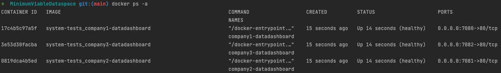

# Developer documentation

## Cloud environment setup

Please follow the [instructions to set up continuous deployment and initializing an Azure environment](continuous-deployment/continuous_deployment.md).

## Local development setup

Please follow the instructions in [this document](../../system-tests/README.md) to setup a local MVD environment for development purposes.

## Data Dashboard

The Data Dashboard is a web application (development UI) on top of EDC's DataManagementAPI and is deployed for each participant. It can be accessed at the URLs locally. Example:

| Participant | URL |
| --- | --- |
| Company 1 | http://localhost:7080 |
| Company 2 | http://localhost:7081 |
| Company 3 | http://localhost:7082 |

### Scenarios covered

- [Adding an Asset](edc-data-dashboard/add-asset.md)
- [Adding a Policy](edc-data-dashboard/add-policy.md)
- [Publishing Assets](edc-data-dashboard/publish-asset.md)
- [Viewing the Catalog](edc-data-dashboard/view-catalog.md)
- [Negotiating a Contract](edc-data-dashboard/negotiate-contract.md)
- [Browsing Contract Agreements](edc-data-dashboard/contract-agreements.md)
- [Initiating a Data Transfer](edc-data-dashboard/initiate-transfer.md)
- [Browsing the Transfer History](edc-data-dashboard/transfer-history.md)
