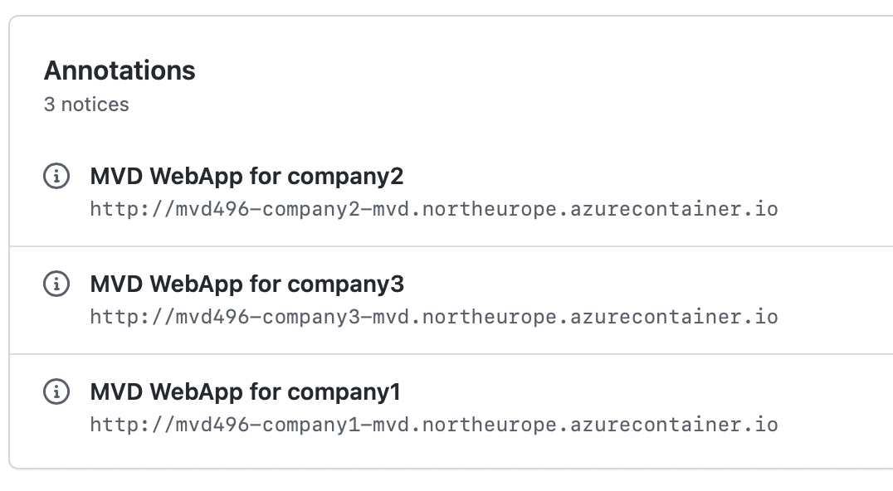

# Developer documentation

## Environment setup

- [Continuous Deployment and Initializing an Azure environment for CD](continuous_deployment.md)

## Data Dashboards

### Accessing the Data Dashboards

The Data Dashboard web application for each participant can be accessed at the URLs provided in the GitHub workflow run page. Example:

### Scenarios covered

- [Adding an Asset](edc-data-dashboard/add-asset.md)
- [Adding a Policy](edc-data-dashboard/add-policy.md)
- [Publishing Assets](edc-data-dashboard/publish-asset.md)
- [Viewing the Catalog](edc-data-dashboard/view-catalog.md)
- [Negotiating a Contract](edc-data-dashboard/negotiate-contract.md)
- [Browsing Contract Agreements](edc-data-dashboard/contract-agreements.md)
- [Initiating a Data Transfer](edc-data-dashboard/initiate-transfer.md)
- [Browsing the Transfer History](edc-data-dashboard/transfer-history.md)
