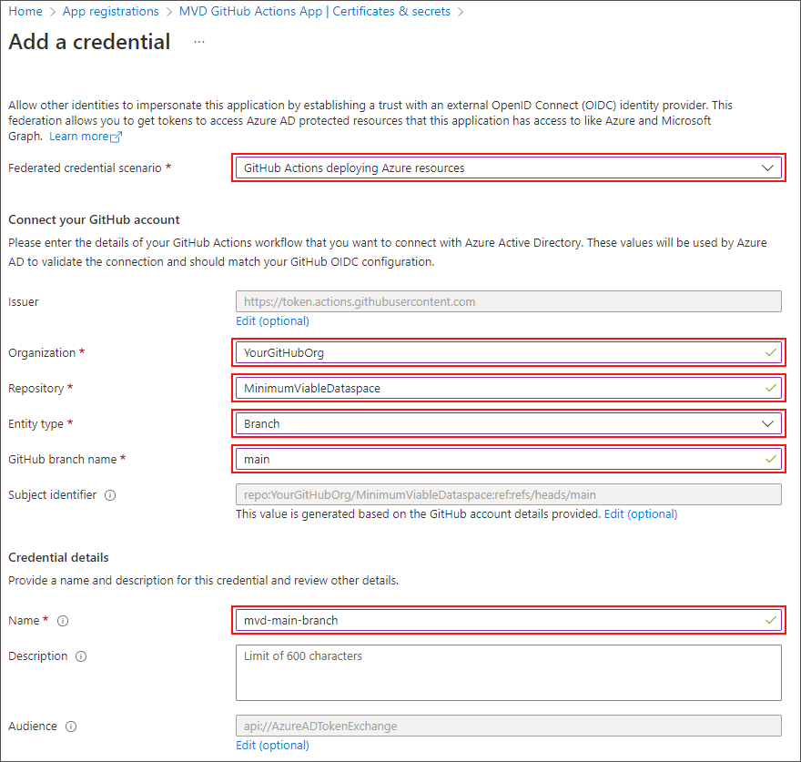
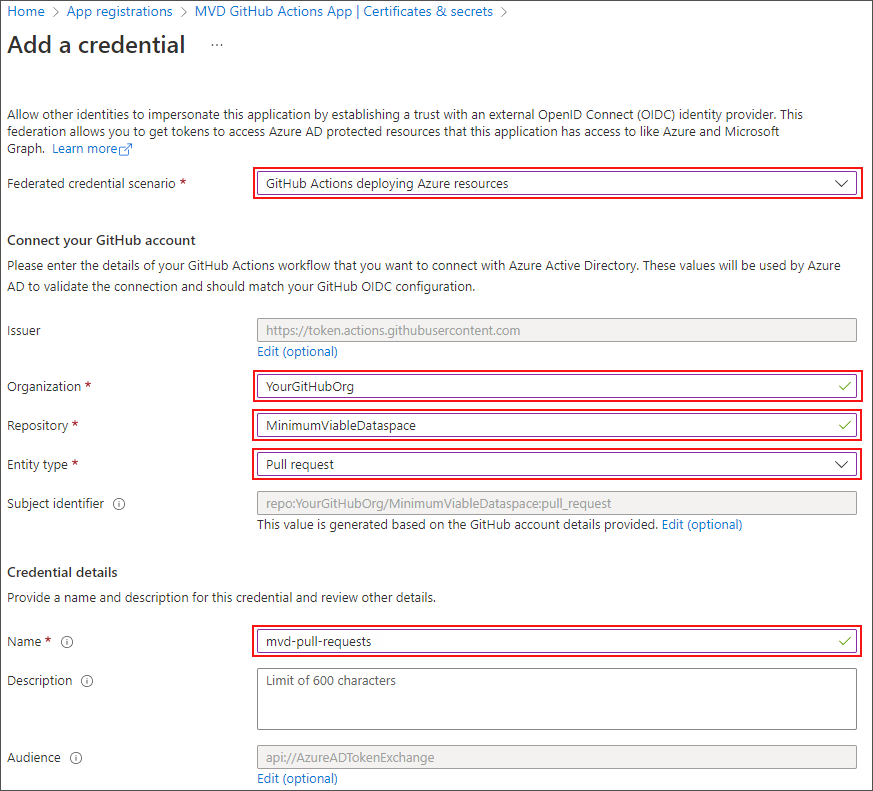
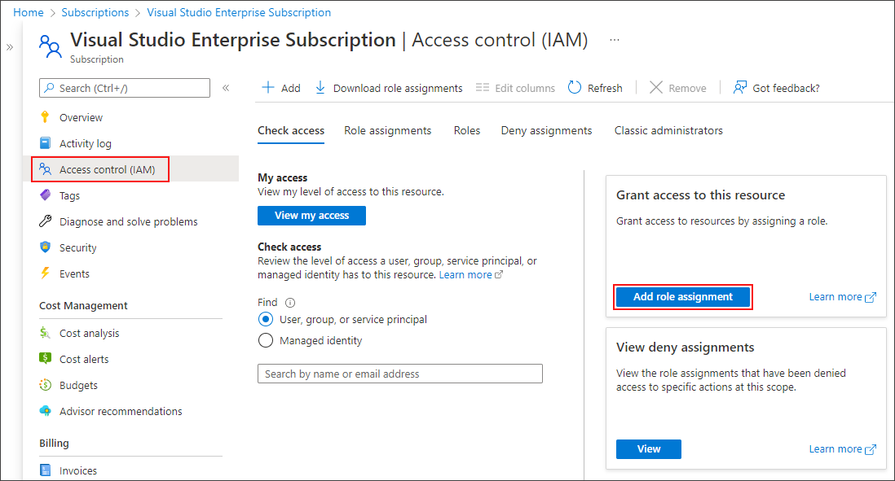
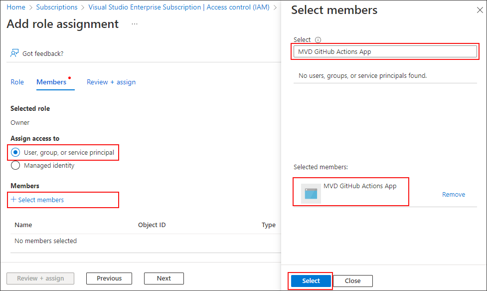
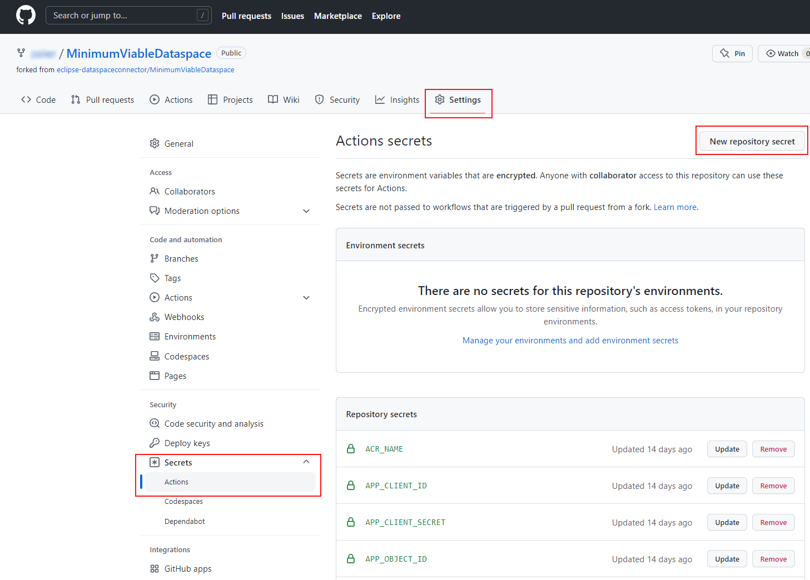
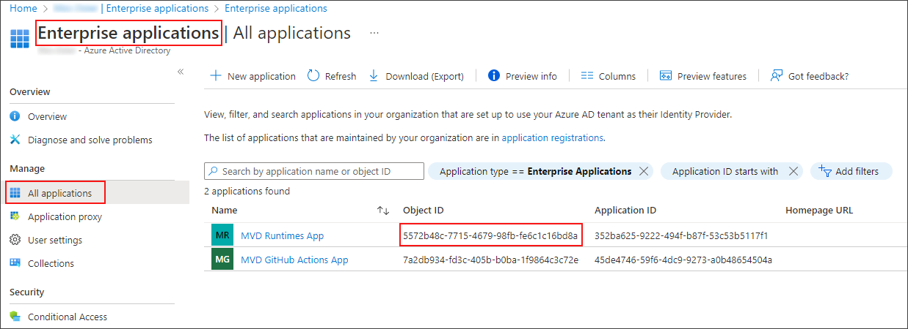

# Continuous Deployment

## Overview

This document describes how to set up your environment to deploy MVD instances to your Azure subscription.

Continuous integration and continuous deployment of the MVD to an Azure subscription is performed by [GitHub Actions](https://github.com/features/actions) workflows.

The Azure subscription and and the GitHub repository need to be set up with the required configuration and credentials before the MVD can be deployed.

The following steps will be performed:

- An **application** is created to represent the action runner that provisions cloud resources. In Azure Active Directory, a service principal for the application is configured in the cloud tenant, and configured to trust the GitHub repository using Federated Identity Credentials.
- Another **application** is created to represent the deployed MVD runtimes for accessing Azure resources (such as Key Vault). For simplicity, all runtimes share a single application identity. In Azure Active Directory, a service principal for the application is configured in the cloud tenant. A client secret is configured to allow the runtime to authenticate.
- [GitHub secrets](https://docs.github.com/en/actions/security-guides/encrypted-secrets) are created to hold configuration values and credentials.

Once the configuration is in place, a GitHub workflow needs to be run to provision the Azure resources used for CD:

- An **Azure Container Registry** instance is deployed to contain docker images built in the CI job. These images are deployed to runtime environments in the CD process.
- An **Azure Storage Account** and a storage container to store **Terraform state** between the deployment and destroy jobs.

## Planning Your Deployment

You will need to provide the following:

- An Azure subscription
- Two service principals (instructions to create them below)
- A fork of the [MVD repository](https://github.com/eclipse-dataspaceconnector/MinimumViableDataspace) and permissions to configure GitHub secrets

## Create a Service Identity for GitHub Actions

Further documentation for the following steps can be found in the Microsoft Docs to [Configure an app to trust a GitHub repo](https://docs.microsoft.com/azure/active-directory/develop/workload-identity-federation-create-trust-github).

### Create App Registration for GitHub Actions

Sign in to the [Azure Portal](https://portal.azure.com/), navigate to *App registrations* and select *New registration*.

Register a new application:

- **Name**: Provide a display name for the application, e.g. *"MVD GitHub Actions App"*
- In **Supported Account Types**, select **Accounts in this organizational directory only**.
- Don't enter anything for **Redirect URI (optional)**.

Select **Register** to create the app registration.

Take note of the *Application (client) ID* (will be required to configure a GitHub secret below).

Next, we create two types of credentials: two federated credentials to authenticate GitHub Actions, and a client secret for Terraform (required as Terraform does not yet support Azure CLI login with a service principal).

### Configure `main` Branch Credentials

Select the previously created application (e.g. *"MVD GitHub Actions App"*) and navigate to **Certificates & secrets**.

Select **Federated credentials**, click **Add credential** and define the following values.

- For **Federated credential scenario**, select **GitHub actions deploying Azure resources**.
- For **Organization**, add your GitHub organization. For example, your organization is *YourGitHubOrg* if the URL of your GitHub repository is [https://github.com/YourGitHubOrg/MinimumViableDataspace](https://github.com/YourGitHubOrg/MinimumViableDataspace).
- For **Entity Type**, select **Branch**.
- For **GitHub branch name**, enter `main`.
- For **Name**, enter a name for the credential, e.g. *"mvd-main-branch"*.

Click **Add** to create the credential.

ℹ️ *Note: You can add additional credentials to deploy from other branches*

### Configure Pull Request Credentials

Now, we set up a federated credential for pull requests, which allows to run a cloud deployment to validate pull requests.

ℹ️ *Note: This step is only required if you plan to create pull requests for the MVD.*

Click **Add credential** to add another credential (for the previously created application (e.g. *"MVD GitHub Actions App"*), under **Certificates & secrets**, **Federated credentials**).

- For **Federated credential scenario**, select **GitHub actions deploying Azure resources**.
- For **Organization**, add your GitHub organization. For example, your organization is *YourGitHubOrg* if the URL of your GitHub repository is [https://github.com/YourGitHubOrg/MinimumViableDataspace](https://github.com/YourGitHubOrg/MinimumViableDataspace).
- For **Entity Type**, select **Pull Request**.
- For **Name**, enter a name for the credential, e.g. *"mvd-pull-requests"*.

Click **Add** to create the credential.

### Create Client Secret for GitHub Actions

Navigate to the **Client secrets** tab (for the previously created application (e.g. *"MVD GitHub Actions App"*), under **Certificates & secrets**), and select **New client secret**. Create a new client secret by entering a **Description** (e.g. *"mvd-client-secret"*) and clicking **Add**.

Take note of the client secret (**Value**) and keep it safe (will be required to configure a GitHub secret below).

### Grant Permissions for Azure Subscription

To allow GitHub Actions to deploy resources to your Azure subscription, grant the application created above Owner permissions on your Azure subscription.
Further documentation for the following steps can be found under [Assign Azure roles using the Azure portal](https://docs.microsoft.com/azure/role-based-access-control/role-assignments-portal).

Navigate to your **subscription** you want to deploy the MVD resources to, select **Access control (IAM)** and click on **Add role assignment**.

On the **Add role assignment** page, select **Owner** and click **Next**.

Now click on **Select members**, search for the application created above (e.g. *"MVD GitHub Actions App"*), click **Select** and then click on **Next** and then on **Review + assign** to assign the application Owner permissions on your Azure subscription.

⚠️ You need to enter the full application name when searching for the application, the application will not show up if you only enter a partial name (e.g. *"MVD GitHub Act"* in the example above).

### Configure GitHub Secrets for GitHub Actions

Finally, the application (client) ID and the application client secret needs to be made available to your GitHub repository using [GitHub secrets](https://docs.github.com/en/actions/security-guides/encrypted-secrets).

To configure GitHub Secrets, navigate to your `MinimumViableDataspace` repository, select **Settings**, navigate to **Secrets** and then **Actions**, and click **New repository secret** to create a new secret.

Configure the following GitHub secrets with the values from the steps above:

| Secret name         | Value                          |
| ------------------- | ------------------------------ |
| `ARM_CLIENT_ID`     | The application (client) ID of the application created above (e.g. *"MVD GitHub Actions App"*). |
| `ARM_CLIENT_SECRET` | The application client secret (**Value**) created above. |

## Create Service Identity for MVD Runtimes

Further documentation for the following steps can be found in the Microsoft Docs to [Create and configure an Azure AD application for the application runtimes](https://docs.microsoft.com/azure/active-directory/develop/workload-identity-federation-create-trust-github).

### Create App Registration for MVD Runtimes

Sign in to the [Azure Portal](https://portal.azure.com/), navigate to *App registrations* and select *New registration*.

Register a new application:

- **Name**: Provide a display name for the application, e.g. *"MVD Runtimes App"*
- In **Supported Account Types**, select **Accounts in this organizational directory only**.
- Don't enter anything for **Redirect URI (optional)**.

Select **Register** to create the app registration.

Take note of the *Application (client) ID* (will be required to configure a GitHub secret below).

### Create Client Secret for MVD Runtimes

Navigate to **Certificates & secrets** and then to the **Client secrets** tab (for the previously created application (e.g. *"MVD Runtimes App"*), and select **New client secret**. Create a new client secret by entering a **Description** (e.g. *"mvd-runtimes-app-client-secret"*) and clicking **Add**.

Take note of the client secret (**Value**) and keep it safe (will be required to configure a GitHub secret below).

### Get Application Object ID

Navigate to **Azure Active Directory** and select **Enterprise Applications**.

Take note of the enterprise application **Object ID**.

⚠️ Make sure you use the Object ID of the *Enterprise application*, and not the Object ID of the *App Registration*!

### Configure GitHub Secrets for MVD Runtimes

Configure the following GitHub secrets with the values from the steps above:

| Secret name         | Value                          |
| ------------------- | ------------------------------ |
| `APP_CLIENT_ID`     | The application (client) ID.   |
| `APP_CLIENT_SECRET` | The application client secret. |
| `APP_OBJECT_ID`     | The ID of the service principal object associated with this application. |

See instructions under [Configure GitHub Secrets for GitHub Actions](#configure-github-secrets-for-github-actions) on how to configure GitHub secrets.

## Configure CD Settings

Configure the following GitHub secrets which are required by the CD pipeline:

| Secret name                   | Value                                                        |
| ----------------------------- | ------------------------------------------------------------ |
| `ARM_TENANT_ID`               | The Azure Active Directory **Tenant ID**. Navigate to Azure Active Directory and copy the Tenant ID from the *Overview* page. |
| `ARM_SUBSCRIPTION_ID`         | The Azure **Subscription ID** to deploy resources to. Navigate to Subscriptions and copy the *Subscription ID* of your subscription. |
| `COMMON_RESOURCE_GROUP`       | The Azure resource group name to deploy common resources to, such as Azure Container Registry. Choose any valid resource group name, e.g. *rg-mvd-common*. |
| `COMMON_RESOURCE_GROUP_LOCATION` | The location where common resources should be deployed to, e.g. *northeurope*. |
| `ACR_NAME`                    | The name of the Azure Container Registry to deploy. Use only lowercase letters and numbers. |
| `TERRAFORM_STATE_STORAGE_ACCOUNT` | The name of the storage account used to store the Terraform state container, e.g. *mvdterraformstates*. |
| `TERRAFORM_STATE_CONTAINER` | The name of the container used to store the Terraform state blob, e.g. *mvdterraformstates*. |

Update the value of the `CD_RESOURCES_PREFIX` env in the [cloud-cd.yaml](../../../.github/workflows/cloud-cd.yaml) file.
This prefix allows to have unique resource names across fork repositories when running CD workflows.

See instructions under [Configure GitHub Secrets for GitHub Actions](#configure-github-secrets-for-github-actions) on how to configure GitHub secrets.

For further information on Azure resouce naming, please refer to [naming conventions](https://docs.microsoft.com/en-us/azure/cloud-adoption-framework/ready/azure-best-practices/resource-naming) and [naming rules and restrictions for Azure resources](https://docs.microsoft.com/en-us/azure/azure-resource-manager/management/resource-name-rules).

## Deploy Common CD Resources

Common resources need to be deployed once, these resources will be used by all CD pipelines.

Manually run the `Initialize CD` GitHub Actions workflow and make sure that it passes successfully.

Your infrastructure is now set up to run deployments, you can now e.g. run the `Deploy` GitHub Actions workflow.

## Azure Location for MVD Deployments

To change the location where MVD instances will be deployed to, you can optionally change the location in the [variables.tf file](../../../deployment/terraform/dataspace/variables.tf) for the dataspace authority and in the [variables.tf file](../../../deployment/terraform/participant/variables.tf) for dataspace participants.
