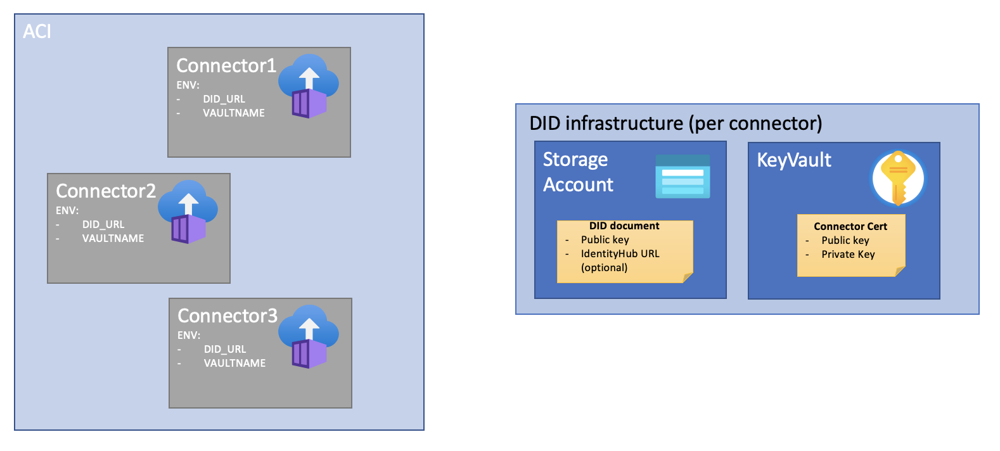
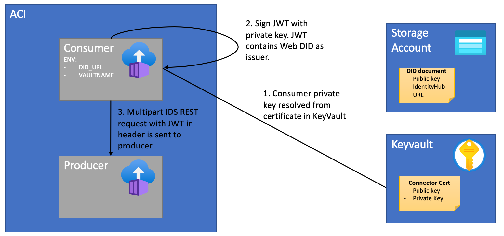
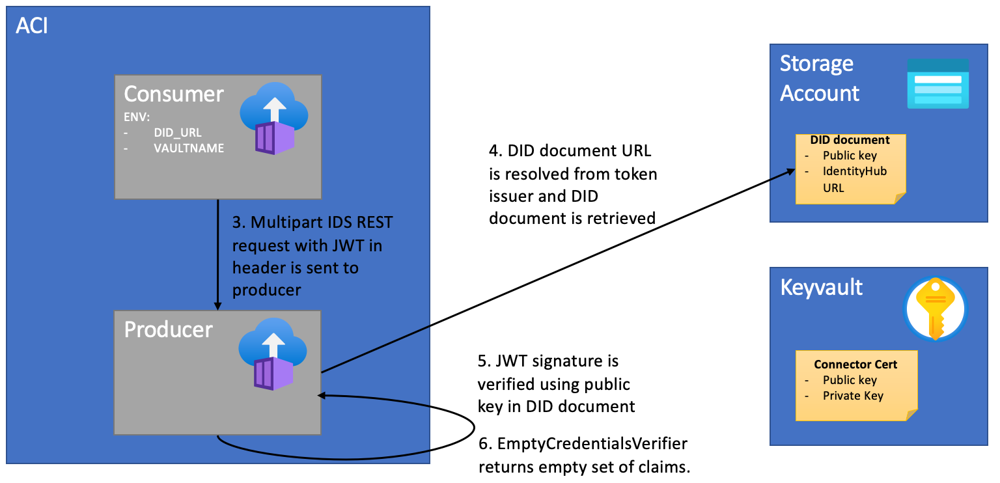

# Decentralized Identity

Decentralized identifiers (DIDs) enable verifiable, decentralized digital identity. DIDs have been designed so that they may be decoupled from centralized registries, identity providers, and certificate authorities. 

[The DID core specification](https://www.w3.org/TR/did-core/) describes syntax, a common meta-model, operations and more, but offers full flexibility to choose any particular technology or cryptography to underpin the generation, persistence, resolution, or interpretation of DIDs. Over a hundred [DID methods](https://www.w3.org/TR/did-core/#methods) with different backing technologies are currently [in development](https://w3c.github.io/did-spec-registries/#did-methods).

EDC is based on [DID Web](https://w3c-ccg.github.io/did-method-web/), a DID method that allows bootstrapping trust using a web domain's existing reputation.

## Decision

Use DID Web to authenticate IDS calls between participants of the MVD (Minimum Viable Dataspace).

Authorization through verifiable credentials obtained from [Identity Hub](https://didproject.azurewebsites.net/docs/hub-overview.html) and policies are out of scope of this document.

## Components

The following example shows the deployment of 3 connectors. Each connector requires the following infrastructure for DID Web:
- KeyVault for storing certificates with the connector public and private keys. The certificate in PEM format must be stored as a secret, using the connector name as secret name.
- Storage account for hosting [DID documents](https://w3c.github.io/did-spec-registries/#did-document-properties). DID documents must be exposed at a URL as described in the [DID Web spec](https://w3c-ccg.github.io/did-method-web/#web-did-method-specification) (e.g. `<STORAGE ACCOUNT DOMAIN>/<CONNECTOR_NAME>/did.json`) and must contain the public key in [JWK](https://datatracker.ietf.org/doc/html/rfc7517) format.

Automated continuous deployment should generate certificates, DID documents and deploy these Azure components for each connector instance as part of a CI/CD workflow. See the [DID Core specification](https://www.w3.org/TR/did-core/#did-documents) for some sample DID documents, and refer to the [reference showcase](https://github.com/microsoft/edc-showcase/blob/main/scripts/did/template/template.json) for a DID Web specific DID document template.

## Authentication flow

### Sending IDS requests

EDC sends IDS requests with a header containing a [JSON Web Token (JWT)](https://jwt.io/introduction). The JWT is generated using the private key in the certicate available in the KeyVault of the consumer connector. The DID is set as issuer of the JWT. The environmental variables `VAULTNAME` and `DID_URL` need to be set to the KeyVault name and DID respectively, for the EDC connector to perform this work correctly. 

### Receiving IDS requests

Upon reception, the provider connector verifies the JWT. To achieve this, the DID document URL is resolved from the DID available as the token issuer as described in the [DID Web specification](https://w3c-ccg.github.io/did-method-web/#method-specific-identifier). The public key is retrieved from the DID document, which is then used by the provider connector to verify the JWT and thus the identity of the token's signer. 

Note: since tokens are credentials, great care must be taken to prevent security issues. In general, JWTs should not be kept longer than required (expire them as soon as possible).

No Identity Hub integration is desired at this point. An `EmptyCredentialsVerifier` must be used, returning an empty claim collection. Identity Hub integration will be evaluated later together with policies.

