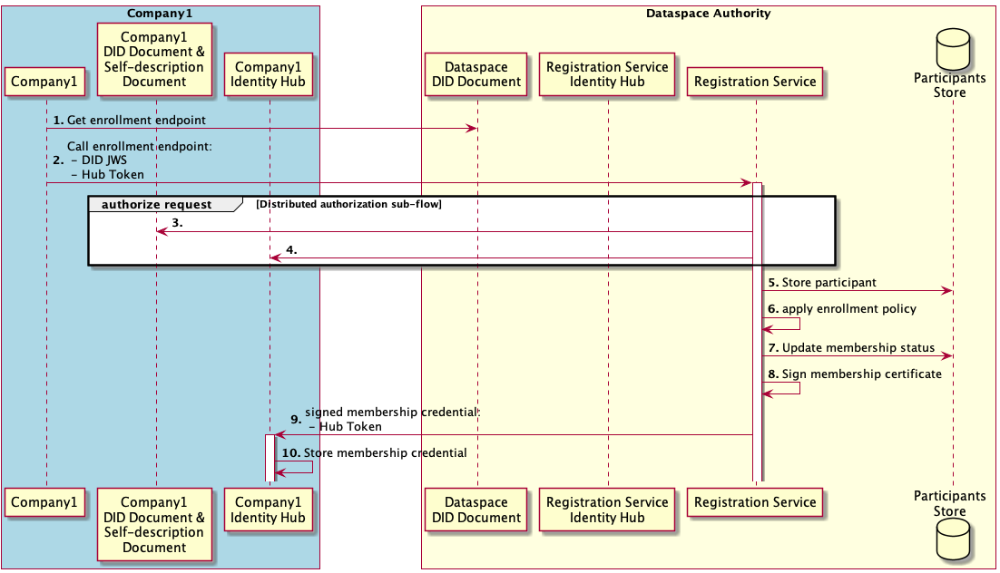
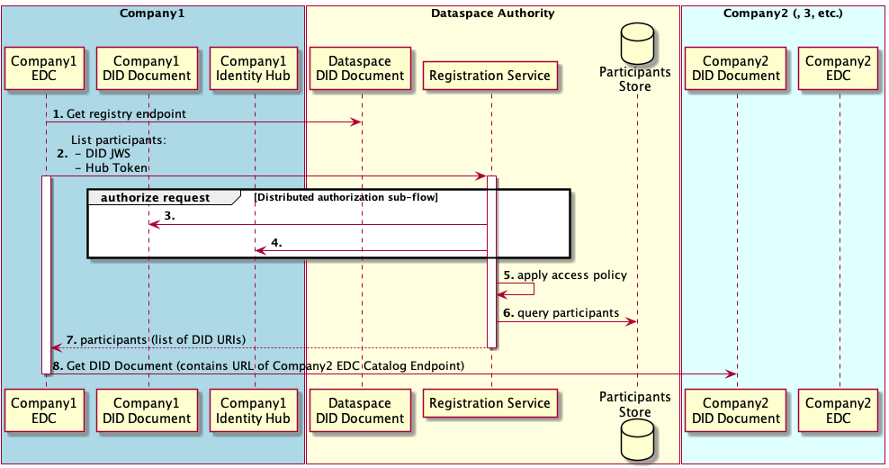

# Registration Service

Registration Service is a component of a Dataspace Authority. In the current version, the Dataspace Authority is centralized to support the [Minimum Viable Dataspace](https://github.com/eclipse-dataspaceconnector/MinimumViableDataspace) (MVD). In future versions, the Authority could also be partly or fully decentralized.

Responsibilities of the Dataspace Authority in MVD:
- Establishes a DID (Decentralized Identifier) defining the Dataspace.
- Manages policies defining who is allowed to participate in the dataspace.
- Manages enrollment process of the Dataspace participants.
- Lists the DID of available Dataspace participants.

## Deployment

The Registration Service is deployed as a separate component in the Dataspace environment. Deployment workflows and artifacts are provided in the  [Minimum Viable Dataspace](https://github.com/eclipse-dataspaceconnector/MinimumViableDataspace) repository.

## Identity

The Registration Service endpoint can be resolved from the `did:web` document deployed for the Dataspace Authority.

In future versions, the Registration Service endpoint will be resolved in a Self-Description Document whose URL is available in the the `did:web` document. This version uses a simplified process omitting the Self-Description Document.

## Operations

Operations supported by the Registration Service:
- [Dataspace participant enrollment](#1-dataspace-participant-enrollment)
- [Listing all Dataspace participants](#2-list-participants)

Operations that will be supported in future versions of the Registration Service:
- Dataspace participant offboarding
- Blacklisting

### 1. Dataspace participant enrollment

#### Participants

1. _Company1_, an entity which intends to become a Dataspace participant
2. _The Dataspace Authority_, which manages the enrollment process

#### Overview

A Client for _Company1_ initiates the enrollment process by resolving and contacting the enrollment API endpoint for the _Dataspace Authority_. (The client could be e.g. a CLI utility.)

_The Dataspace Authority_ enrollment service obtains Verifiable Credentials (VCs) from _Company1_ to determine whether it meets enrollment policies. The enrollment service then issues a Verifiable Credential that establishes membership and pushes it to _Company 1's_ Identity Hub, and stores membership and certificate information.

In simple scenarios, enrollment could be fast and fully automated. However, in advanced scenarios, enrollment policies could require interactions with external systems, and even manual processes, therefore, it is implemented asynchronously.

#### Pre-conditions

1. _Company1_ has deployed an Identity Hub service, and a DID Document containing the Identity Hub URL.
2. _Company1_ knows the DID URL of the Dataspace it intends to join.
3. The _Company1_ Identity Hub contains VCs that satisfy _the Dataspace Authority_ enrollment policy. In MVD, a credential `{"gaiaXMember": "true"}` is seeded for each deployed participant, signed by a fake GAIA-X authority.

#### Post-conditions

1. The _Company1_ Identity Hub contains a VC signed by _the Dataspace Authority_, that establishes membership in _Dataspace D_. This is used by other participants to authorize requests from _Company1_.
2. The _Company1_ DID URL is stored in the Registration Service Participants Store. This is used to serve participant requests.

#### Flow sequence

1. The Client for _Company1_ initiates the enrollment process based on the Dataspace DID URL. It retrieves the DID Document, and parses it to retrieve Dataspace
   enrollment HTTP endpoint.
2. The client needs access to the _Company1_ Private Key to sign a JWS. The client sends an HTTP request to _the Dataspace Authority_ enrollment endpoint. The
   request is accepted for asynchronous processing.
3. The Registration Service uses the [Distributed authorization sub-flow](../2022-06-16-distributed-authorization/README.md) to authenticate the 
   request...
4. ... and retrieves credentials from _Company1's_ Identity Hub.
5. The Registration Service stores participant information in its store. This includes Company 1's DID URL.
6. The Registration Service authorizes the request by applying the Dataspace enrollment policy on the obtained Verifiable Credentials. In MVD, the service checks for a credential `{"gaiaXMember": "true"}` signed by any issuer (as the EDC policy engine does not currently allow restricting trusting claims to specific issuers).
7. The Registration Service updates the status of the participant's membership indicating that the participant's onboarding is successful/failed.
8. The Registration Service issues and signs a membership Verifiable Credential.
9. The Registration Service sends the Verifiable Credential to _Company1's_ Identity Hub for storage. It uses the Identity Hub bearer token (from the Distributed authorization
   sub-flow) to authenticate the request.
10. _Company1's_ Identity Hub validates the bearer token and stores the membership Verifiable Credential.

### 2. List participants

#### Participants

1. _Company1_, a Dataspace Participant with a Dataspace Connector (e.g. EDC application) that wants to discover IDS endpoints (e.g. in order to list contract offers)
2. _The Dataspace Authority_, which manages Dataspace memberships
3. _Company2_, _Company3_, etc., Dataspace Participants

#### Overview

A typical EDC deployment caches contract offers from other participants in a federated catalog, so that users can quickly browse and negotiate contracts. To regularly retrieve offers, it regularly contacts the Registration Service to refresh its list of Dataspace Participants, then obtains contract offers from each participants to refresh its cache.

In this flow, the EDC for _Company1_ obtains a list of Dataspace Participants and resolves their IDS endpoints.

#### Pre-conditions

Participants are registered as (currently valid) Dataspace Participants

#### Flow sequence

1. The EDC for _Company1_ determines the Registration Service endpoint from the Dataspace DID Document.
2. The EDC for _Company1_ issues a request to the Registration Service, to list participants.
3. The Registration Service uses the [Distributed authorization sub-flow](../2022-06-16-distributed-authorization/README.md) to authenticate the 
   request...
4. ... and retrieves Verifiable Presentations from _Company1's_ Identity Hub.
5. The Registration Service authorizes the request by applying the access policy on the obtained Verifiable Presentations. For example, the caller must be a valid
   Dataspace Participant.
6. The Registration Service obtains the list of Dataspace Participant DID URIs from its storage...
7. ... and returns it synchronously to the caller (_Company1_ EDC).
8. The EDC for _Company1_ iterates through the Participants' DID URIs, and retrieves the collection of their IDS endpoints from their DID Documents.

## References

- [Identity Hub in MVD](https://github.com/eclipse-dataspaceconnector/IdentityHub/blob/main/docs/developer/decision-records/2022-06-08-identity-hub/README.md)
