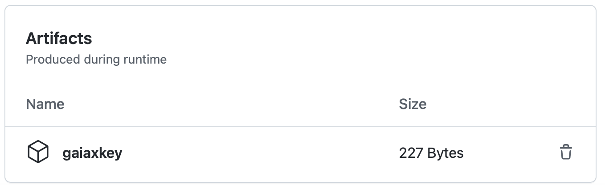

# Deployment of Verifiable Credentials

## Decision

### Signing authorities

Two authorities issuing Verifiable Credentials are established in MVD:

- A GAIA-X authority
- A Dataspace authority

For simplicity, both authorities are deployed in a single job in each MVD deployment.

Each authority has:

- A private key in ECDSA P-256 format, generated by the deployment workflow.
- A DID Document published to a public blob endpoint by the deployment workflow. The DID Document contains the public key corresponding to the private key.

### GAIA-X Verifiable Credentials

As part of deployment, the workflow generates the following verifiable credentials for each deployed participant. It signs them with the GAIA-X authority private key, and publishes them to the participant's Identity Hub.

- A GAIA-X membership credential with the payload `{"gaiaXMember": "true"}`.
- A region credential with the payload `{"region": "<region>"}`, where `<region>` is `eu` or `us` depending on the participant.

The verifiable credentials can be used:

- By the Registration Service, to apply dataspace enrollment policies.
- By each participant, to apply EDC policies.

### Dataspace Membership Verifiable Credential

As part of dataspace onboarding, the Registration Service generates the following verifiable credential for a successfully onboarded participant. It signs it with the Dataspace authority private key, and publishes it to the participant's Identity Hub.

- A dataspace membership credential with the payload `{"memberOfDataspace": "<did>"}`, where `<did>` is the did:web dataspace identifier.

### GAIA-X Private key

The GAIA-X authority private key is available to repository committers as a downloadable artifact in the GitHub workflow run. This is done for presentation/development purposes.

This allows users who extend MVD with additional policies to publish additional verifiable credentials into their deployments, using the [Identity Hub CLI](https://github.com/eclipse-dataspaceconnector/IdentityHub/tree/main/client-cli).

## Rationale

This structure illustrates the components involved in onboarding participants in dataspaces in the context of GAIA-X.

In a future iteration, the publicly available test GAIA-X server could be used to generate Verifiable Credentials.
