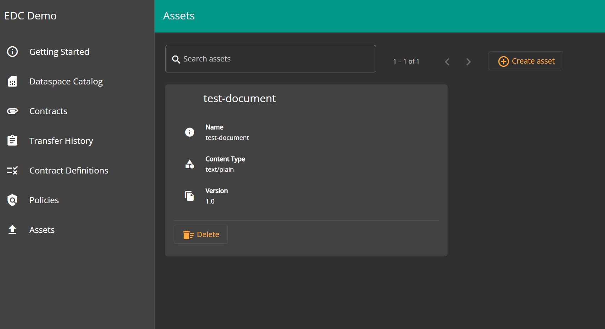
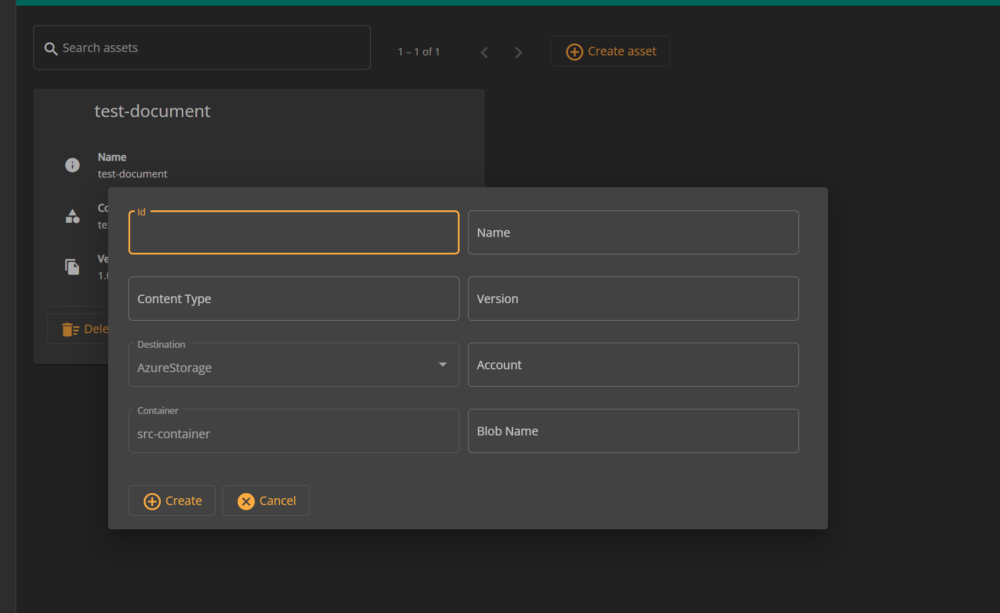
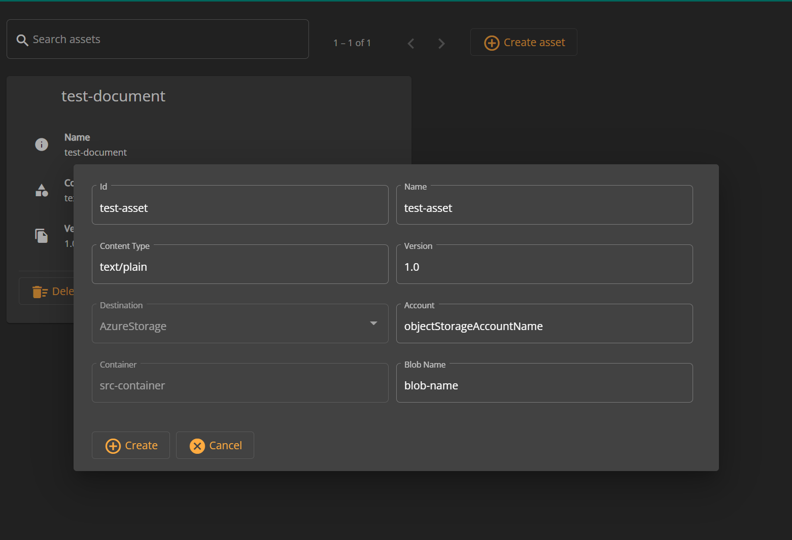
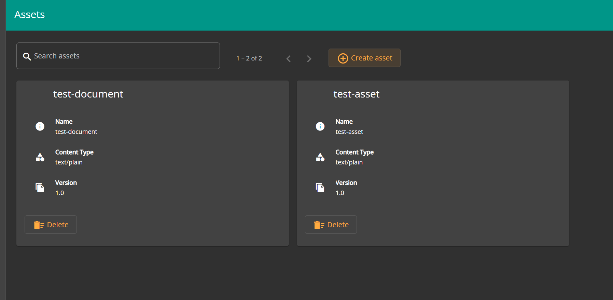

# Add Asset

## Overview

A new asset can be added through the EDC data dashboard, in this process we actually point to a pre-existing asset in a participant's respective object storage account. In the current MVD version, only Azure Object Storage is supported.

If we want to add an asset named as `test-document` then this asset must be already available in the participant's object storage account under a container named as `src-container` before we can add it via the dashboard UI. Refer to the following links for more details about how to upload an asset in Azure Object Storage:

* [Create a container](https://docs.microsoft.com/azure/storage/blobs/storage-quickstart-blobs-portal#create-a-container)
* [Upload a blob](https://docs.microsoft.com/azure/storage/blobs/storage-quickstart-blobs-portal#upload-a-block-blob)

## Prerequisites

Actual asset must be already uploaded in object storage account in a container named as `src-container`.

## Adding an Azure object storage asset

* Go to `Assets` pane and here you will see all existing assets if any.

* Click on `Create asset` button and this will open an UI popup where you can add further details.

* Add a unique ID e.g. UUID for the asset in text box named `id`. This id will be used when selecting asset for publishing. Publishing an asset is covered under [publish-asset.md](./publish-asset.md).
* Add name for the asset in text box named `name`.
* Add content type for the asset in text box named `Content Type`. e.g. `text/plain`. It is just an additional metadata for the content of the asset and it is not used further in EDC data transfer.
* Select the `Destination` type (`Azure Storage` in this case to transfer from Azure Blob Storage to Azure Blob Storage).
* Add object storage account name in text box named as `Account`.
* Define the container within the Azure Object Storage Account in `Container` (pre-defined as `src-container` for the MVD for simplicity reasons).
* Add blob name in text box named as `Blob Name`.

* Click on `Create` button to add the asset.
* `Assets` pane will be refreshed and you will see the newly created asset.

