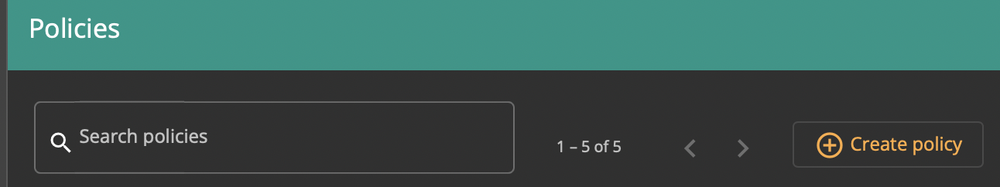
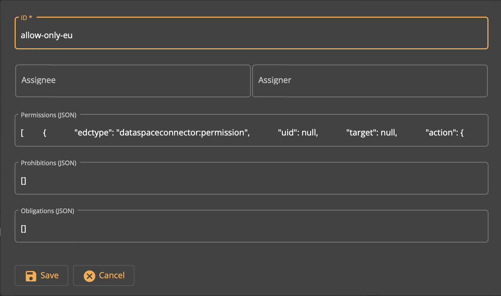

# Adding a Policy

## Overview

*Data Providers can be sure that their data is treated according to the specified usage policies by the IDS Connector of the Data Consumer. Each participant is able to define usage control polices that are attached to outbound data. Policies might include restrictions, e.g. disallowing persistence of data or transfer of data to other parties.* (Source: [Industrial Data Spaces Association, IDS Reference Architecture Model, Version 2.0](https://www.fraunhofer.de/content/dam/zv/de/Forschungsfelder/industrial-data-space/IDS_Referenz_Architecture.pdf))

## Adding a policy

In the *Policies* pane, click the *Create policy* button.



Enter the required data.

- ID: a unique ID string.

- Assignee: a string identifying the Policy assignee. May be blank.

- Assigner: a string identifying the Policy assigner. May be blank.

- Permissions: a JSON string detailing Policy permissions. Use `[]` for an empty list. For example:

  ```
  [
          {
              "edctype": "dataspaceconnector:permission",
              "uid": null,
              "target": null,
              "action": {
                  "type": "USE",
                  "includedIn": null,
                  "constraint": null
              },
              "assignee": null,
              "assigner": null,
              "constraints": [
                  {
                      "edctype": "AtomicConstraint",
                      "leftExpression": {
                          "edctype": "dataspaceconnector:literalexpression",
                          "value": "ids:absoluteSpatialPosition"
                      },
                      "rightExpression": {
                          "edctype": "dataspaceconnector:literalexpression",
                          "value": "eu"
                      },
                      "operator": "EQ"
                  }
              ],
              "duties": []
          }
      ]
  ```

- Prohibitions: a JSON string detailing Policy prohibitions. Use `[]` for an empty list. 

- Obligations: a JSON string detailing Policy obligations. Use `[]` for an empty list. 



Click *Save*. The newly created Policy appears in the *Policies* pane.
