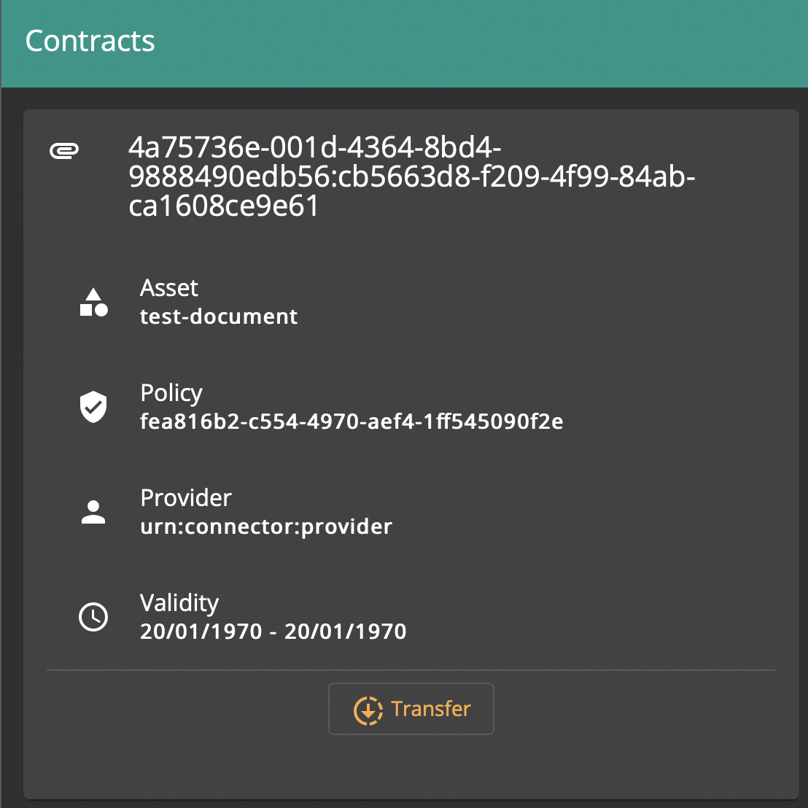

# Browsing Contract Agreements

## Overview

A Contract Agreement is established after a Consumer connector, having obtained a Contract Offer from a Provider connector, negotiates the agreement with the Provider. Afterwards the Contract Agreement can be executed to have the Provider transfer data to the Consumer.

## Browsing Contract Agreements

In the *Contracts* pane, browse the list of current Contract Agreements on the Consumer side.

For each Contract Agreement, the following fields are displayed:

- Contract Agreement ID
- Asset ID
- Policy ID
- Provider Connector Name
- Validity start and end dates

You can then proceed to [Initiating a Data Transfer](initiate-transfer.md).
