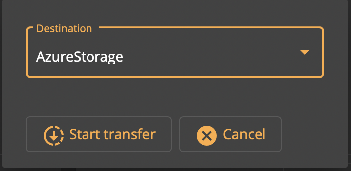

# Initiating a Data Transfer

## Overview

Data Transfer in EDC is an operation by which a Consumer connector and a Provider connector, having previously negotiated a Contract Agreement, execute the Contract Agreement to have the Provider transfer data to the Consumer.

A transfer request is initiated on the Consumer side, sent over to the Provider, and executed in DPF. 

The Consumer provides the Provider with a data destination (such as a cloud object storage with temporary credentials).

The Provider does not notify the Consumer when a transfer has completed (succeeded or failed), see [EDC developer documentation](https://github.com/eclipse-dataspaceconnector/DataSpaceConnector/tree/main/docs/developer/decision-records/2022-04-21-dpf-blob-data-transfer). Depending on the type of destination, the Consumer polls the output (e.g. cloud object storage) to wait for data to be produced.

## Prerequisites

To perform a data transfer, the Consumer must first have successfully executed a Contract Negotiation with the Provider.

## Initiating a transfer

In the *Contracts* pane, locate the [Contract Agreement](contract-agreements.md) to execute. click the *Transfer* button under the agreement.

Select a destination (only *Azure Storage* is currently implemented). Click Start transfer to begin the process.

The UI displays the transfer state as it progresses. When the transfer reaches the *COMPLETED* state, a pop-up appears to indicate completion.

The transfer is displayed in the [*Transfer History* pane](transfer-history.md).
