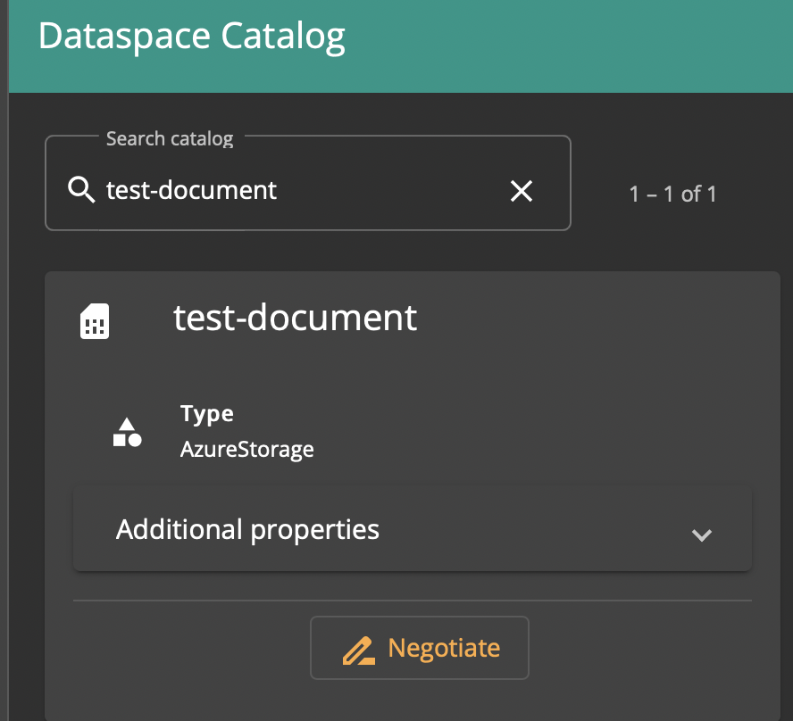
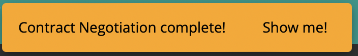

# Negotiating a Contract

## Overview

Asset Negotiation in EDC is an operation by which a Consumer connector, having obtained a Contract Offer from a Provider connector, negotiates a Contract Agreement with the Provider. Afterwards the Contract Agreement  can be executed to have the Provider transfer data to the Consumer.

A negotiation request is initiated on the Consumer side, sent over to the Provider, which sends a Contract Agreement response back to the Consumer (accepted or rejected). 

## Prerequisites

To perform a data transfer, the Consumer must have a Contract Offer from the Provider.

## Initiating a transfer

In the *Dataspace Catalog* pane, click the *Negotiate* button under an asset.

After negotiation completes, a pop-up appears.

You can then proceed to [Initiating a Data Transfer](initiate-transfer.md).
