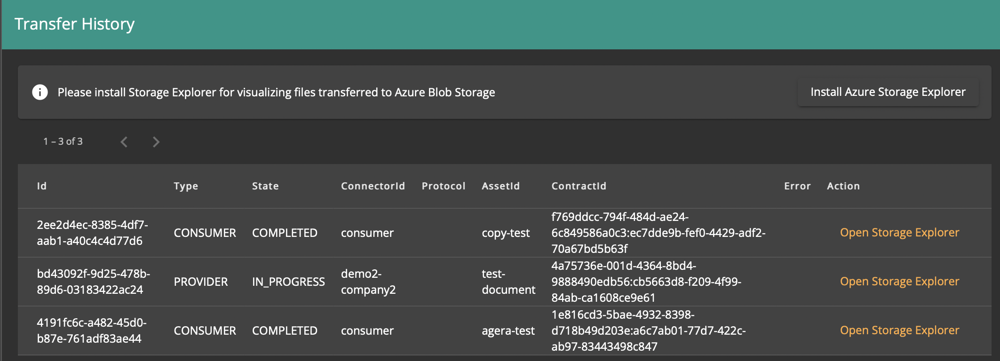

# Browsing the Transfer History

## Overview

The Transfer History pane shows Data Transfers for which the connector was a participant, either as Consumer or Provider.

See [Initiating a Data Transfer](initiate-transfer.md) for more details about the transfer process.

## Browsing the Transfer History

Browse to the *Transfer History* pane.

For each transfer, the UI shows:

- Transfer Process ID
- Type: whether the connector was the Consumer or Provider side of the transfer
- State: transfer completion state (see caveats in [Initiating a Data Transfer](initiate-transfer.md))
- ConnectorId: the counterpart Connector ID
- Protocol: unused
- AssetId: the transferred Asset ID
- ContractId: the Contract Agreement ID used to execute the transfer
- Error: error message if any
- Action: link to a data browser, if available

For data transferred to Azure Storage, The *Open Storage Explorer* link opens the destination storage container in [Azure Storage Explorer](https://azure.microsoft.com/features/storage-explorer) (you will need to install the software beforehand if not available on your machine).

You can see the created assets, as well as a `.complete` marker blob used for the Consumer to detect transfer completion.
