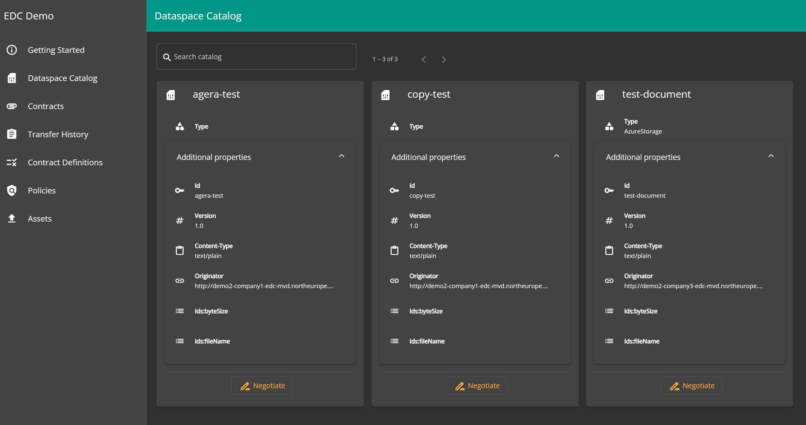
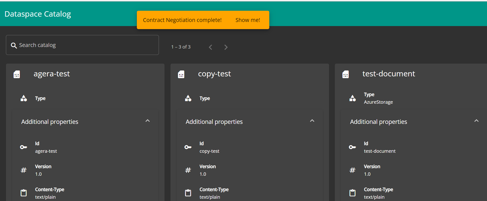

# View Catalog

## Overview

Dataspace participants can use the EDC data dashboard to view contract offers are shared with them. Contract offers are added to the `Catalog` which is refreshed frequently(the refresh interval is configurable per connector) as new contract offers are added by other participants.

## Viewing Catalog/Offers

* Go to `Dataspace Catalog` pane to see list of all existing contract offers which are shared with current dataspce participant.
* Click on `Additional Properties` section to view complete details of the contract offer.

* If you want to perform negotiation on a contract offer, click on `Negotiate` button on the bottom of contract offer card.
* After clicking on `Negotiate` button, a contract offer negotiation will start in background and this will take some time.
* Once the negotiation completes, it will display a UI popup with message `Contract Negotiation complete!`

* Click on link `Show Me` and it will take to `Contracts` pane. Here a transfer can be initiated as per instruction given on [Initiate Transfer](./initiate-transfer.md) doc.
