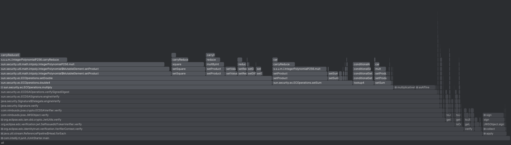
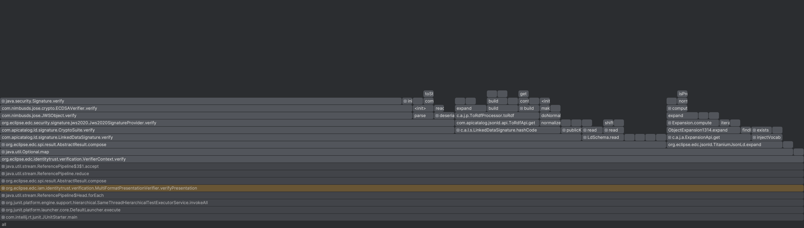

# DCP Performance investigation

## Purpose of this document

This document intends to highlight the difference in computational demands when creating and verifying
VerifiableCredentials represented in JSON-LD ("LDP-VP") versus JsonWebTokens ("JWT-VP").

It should be used as basis for discussion when deciding to use one or the other.

## Methodology

Every test is repeated with a number of [1, 1000, 10000] VerifiableCredentials, that are created ahead-of-time from a
pre-canned JSON document (including a proof object). This is true both for signing and verifying VPs. For every size,
the test is repeated N=10 times, to even out random spikes, e.g. caused by other processes and to allow some VM warmup.

The test results were collected using an MacBook Pro M1 Max and the Temurin-17 JVM.

## Test scenario 1: signing VerifiablePresentations

This scenario is separated in two test cases:

1. `createLdpVp`: creates a JSON-LD VerifiablePresentation with embedded proof
2. `createJwtVp`: creates a JWT that contains the same credentials

NB: both VPs contain LDP-VCs.

Every test was executed 10 times to even out random spikes and to give the VM some time to settle.

### 1.1 Test with JWT-VP

| Num VCs | Overall time [ms] | Mean [ms] | Std-Dev | Var  |
|---------|-------------------|-----------|---------|------|
| 1       | 10                | 1.0       | 0.7745  | 0.88 |
| 1,000   | 324               | 32.4      | 13.63   | 3.69 |
| 10,000  | 2646              | 264.6     | 2.059   | 1.43 |

Using the IntelliJ profiler, the code execution yields the following results:

### 1.2 Test with JWT-VP

| Num VCs | Overall time [ms] | Mean [ms] | Std-Dev | Var   |
|---------|-------------------|-----------|---------|-------|
| 1       | 159               | 15.9      | 21.89   | 4.68  |
| 1,000   | 6146              | 614.6     | 101.27  | 10.03 |
| 10,000  | 77156             | 7715.6    | 217.99  | 14.76 |

Again, using the IntelliJ Profiler, the code execution yields the following results:

### Interpretation of results

As can be seen from the tables above, signing JWT-VPs is roughly 15-20 _faster_ than using LDP-VPs. Even though some of
that may have to do with the concrete implementation (in our
case: [Titanium](https://github.com/filip26/titanium-json-ld)),
this result is not entirely unexpected because handling JSON-LD is a costly operation by nature.

The biggest contributing factors when creating LDP-VPs appear to be the expansion of JSON-LD and the
generation of the LD-proof, which involves the canonicalization of the expanded JSON structure to guarantee reproducible
results. The actual computation of the signature value seems negligible. The following flame graph shows that.

The canonicalization takes up ca 50% of CPU time, the expansion of JSON-LD about 40%, and the rest is distributed among
other tasks. It seems noteworthy, that the actual hashing of the document and the proof only take up about 1.2% CPU
time.

Our code base does not enable remote context loading for various reasons, which means that contexts are held in memory.
Those aforementioned figures are expected to get much worse if remote context loading were enabled.

## Test scenario 2: verifying VerifiablePresentations

In this scenario we verify LDP-VPs containing LDP-VCs, JWT-VPs containing LDP-VCs and pure JWT-VPs containing only
JWT-VCs.

### 2.1 JWT-VP with only JWT-VCs

| Num VCs | Overall time [ms] | Mean [ms] | Std-Dev | Var  |
|---------|-------------------|-----------|---------|------|
| 1       | 59                | 5.9       | 10.71   | 3.27 |
| 1,000   | 7653              | 765.3     | 31.05   | 5.57 |
| 10,000  | 74385             | 7438.5    | 31.11   | 5.58 |

Using the IntelliJ profiler, the code execution yields the following results:

### 2.2 JWT-VP with only LDP-VCs

| Num VCs | Overall time [ms] | Mean [ms] | Std-Dev | Var   |
|---------|-------------------|-----------|---------|-------|
| 1       | 158               | 15.8      | 21.3    | 4.6   |
| 1,000   | 13411             | 1341.1    | 158.58  | 12.59 |
| 10,000  | 127529            | 12752.9   | 490.05  | 22.14 |

Using the IntelliJ profiler, the code execution yields the following results:

### 2.3 LDP-VP with only LDP-VCs

| Num VCs | Overall time [ms] | Mean [ms] | Std-Dev | Var  |
|---------|-------------------|-----------|---------|------|
| 1       | 117               | 11.7      | 18.87   | 3.3  |
| 100*    | 1854              | 185.4.1   | 53.02   | 7.28 |

_*) this testrun was only performed for 100 VCs, as anything beyond that would be limited in terms of significance and
would have dramatically increased test runtime._

Using the IntelliJ profiler, the code execution yields the following results:

Note that the graph was adjusted to filter out CPU cycles that were spent on test preparation.

### Interpretation of results

The graphs indicate - in varying degree of gravity - that the JSON-LD expansion (where involved) tends to have less of
an impact, ca 15% of overall verification time.
